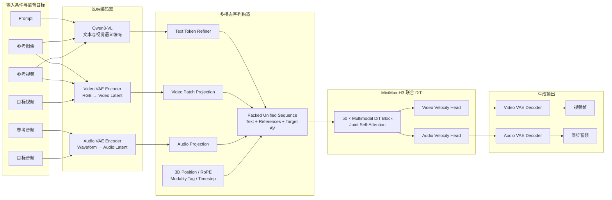
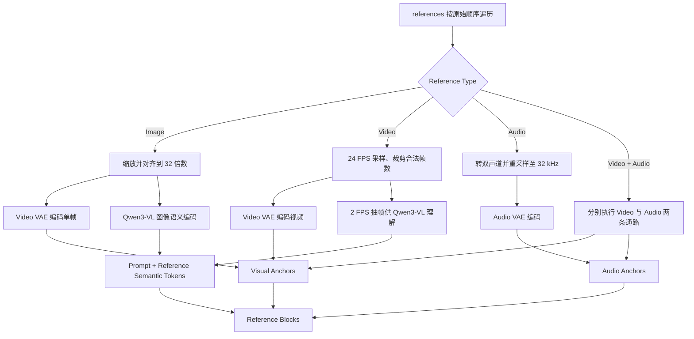
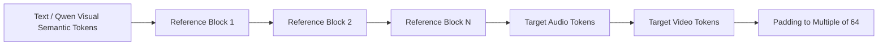
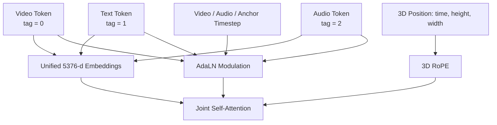
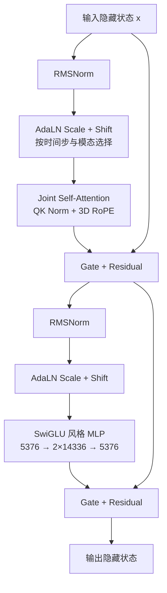
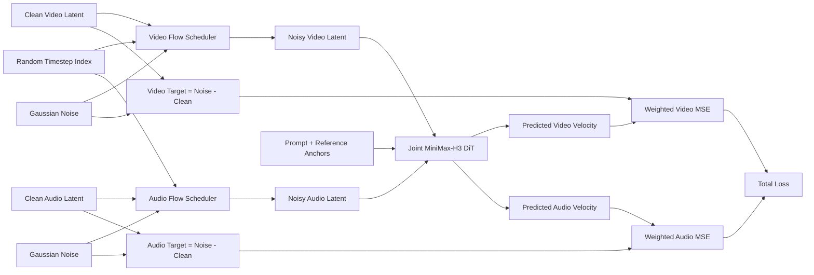
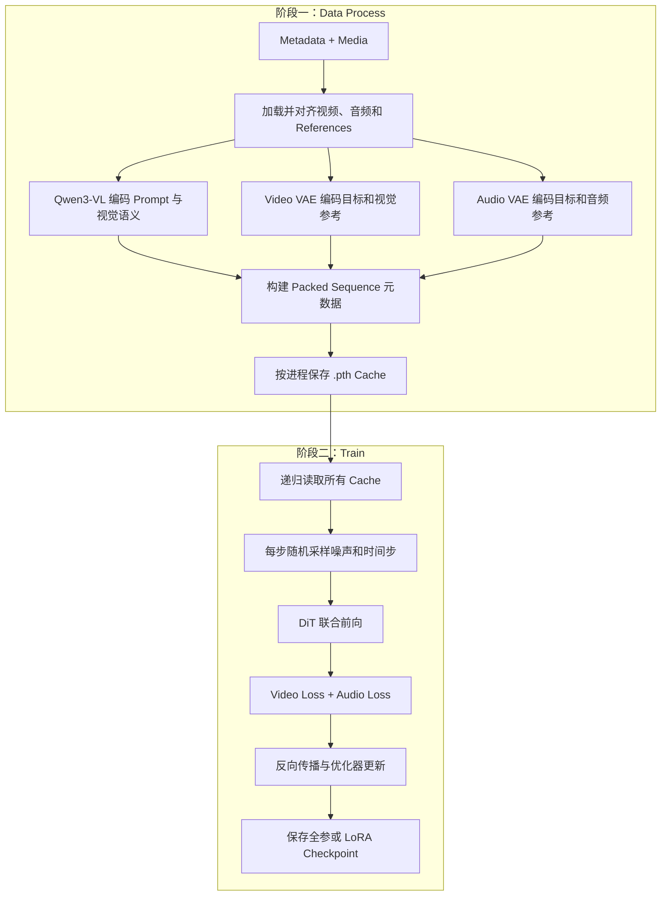
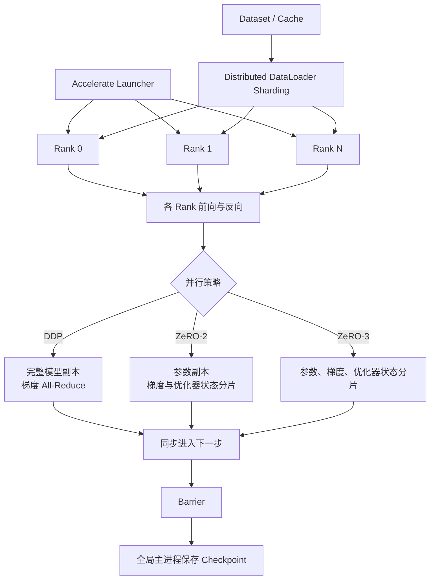
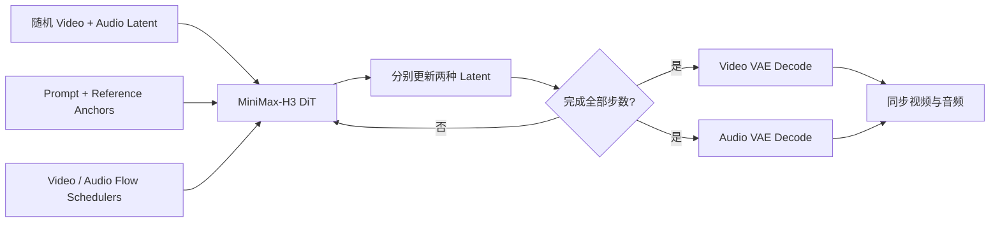

# MiniMax-H3 模型架构与 Ref2VA 训练流程

> 本文基于当前 DiffSynth-Studio 工程实现整理，面向算法、训练和数据团队，用架构图和数据流解释 MiniMax-H3，而不展开代码实现。
>
> 本文重点描述 Ref2VA；FL2VA、ControlNet、Retake 等任务复用同一套音视频联合 DiT 主干，但条件构造方式不同。

## 1. 一页结论

MiniMax-H3 在本工程中是一套**联合生成视频与音频的多模态潜空间 Flow Matching 模型**。其核心思想可以概括为：

```text
Prompt + Reference Image/Video/Audio
                    ↓
     语义编码 + 音视频潜空间编码
                    ↓
Text / Reference / Target Audio / Target Video 统一成一条序列
                    ↓
        单个 50 层多模态 DiT 联合建模
                    ↓
       同时预测 Video Velocity 和 Audio Velocity
                    ↓
              Video VAE / Audio VAE 解码
```

这里的“联合”不是分别训练一个视频扩散模型和一个音频扩散模型，而是让文本、参考条件、目标视频 token 和目标音频 token 进入**同一个 Transformer 注意力空间**。因此，人物动作、口型、事件节奏、环境声音和画面变化能够互相建立依赖关系。

工程默认训练边界是：

- Qwen3-VL、Video VAE 和 Audio VAE 作为冻结的特征与潜空间编码器；
- “全参训练”指 **MiniMax-H3 DiT 全参数微调**，不是文本编码器、VAE、DiT 的全栈联合训练；
- LoRA 训练冻结 DiT 原权重，只更新注意力与 MLP 中注入的低秩参数；
- 标准训练采用“离线缓存 + 正式训练”两个阶段；
- 单机多卡由 Accelerate 驱动，可采用 DDP 或 DeepSpeed ZeRO；多机多卡走相同框架路径。

## 2. 总体架构



### 2.1 模块职责

| 模块 | 主要职责 | 默认训练状态 |
|---|---|---|
| Qwen3-VL | 理解 Prompt、参考图像和参考视频，输出 5120 维语义 token | 冻结 |
| Video VAE | 目标/参考图像与视频和 24 通道视频 latent 之间的转换 | 冻结 |
| Audio VAE | 32 kHz 波形和 32 通道音频 latent 之间的转换 | 冻结 |
| Reference Encoder | 将四类参考条件组织为视觉、音频 anchor | 冻结、只做前向 |
| Packed Sequence Builder | 统一排列文本、参考、目标音频和目标视频 token | 无可训练参数 |
| Token Refiner | 在进入主干前细化文本语义 token | 属于 DiT |
| MiniMax-H3 DiT | 在统一序列中进行跨模态联合注意力并预测双流 velocity | 全参或 LoRA 训练 |
| Video/Audio Output Head | 将统一隐藏状态还原为两种 latent velocity | 属于 DiT |
| ControlNet | 可选的控制视频残差分支，不是 Ref2VA 默认必需模块 | 按具体任务配置 |

## 3. 条件编码与 Ref2VA 原理

Ref2VA 支持四类参考块，并保留它们在数据中的先后顺序：

| 参考类型 | 语义通路 | 潜空间通路 | 主要提供的信息 |
|---|---|---|---|
| Image | 图像送入 Qwen3-VL | 图像送入 Video VAE | 身份、外观、商品、场景、风格 |
| Video | 抽帧后送入 Qwen3-VL | 完整采样片段送入 Video VAE | 动作、镜头、时序视觉信息 |
| Audio | 在语义序列中插入音频条件标识 | 波形送入 Audio VAE | 音色、语音、音乐、环境声 |
| Video + Audio | 视频送入 Qwen3-VL，同时标识音频条件 | 分别送入 Video VAE 和 Audio VAE | 完整视听参考 |

同一项视觉参考会形成两种互补信息：

1. **Qwen3-VL 语义 token**：回答“参考内容是什么”；
2. **Video VAE anchor**：保留“参考内容在生成潜空间中的细节是什么”。

音频参考的真实波形不进入 Qwen3-VL，而是由 Audio VAE 转为音频 anchor；文本序列中的音频条件标识负责把它与 Prompt 中的指代关系对应起来。



### 3.1 参考条件的保真时间步

参考 anchor 与待生成目标被放入同一序列，但两者承担的角色不同：

- 目标视频与目标音频是当前训练时间步上的 noisy latent，需要模型预测其更新方向；
- 参考 anchor 是高保真条件，不作为最终预测目标；
- 视觉参考默认条件强度为 `0.999`，允许极少量扰动；
- 音频参考默认条件强度为 `1.0`，保持 clean anchor；
- 模型输出时会剔除参考位置，只保留目标视频和目标音频位置的预测。

这一设计相当于在同一注意力空间中放置“近乎干净的证据”和“需要去噪的目标”，让目标 token 主动从参考 token 获取信息。

## 4. 潜空间与 Token 化

### 4.1 Video VAE

Video VAE 的编码端采用因果 3D 卷积、残差块和分层时空降采样，解码端采用 3D ViT Decoder。其关键行为是：

- RGB 视频被压缩为 24 通道 latent；
- 空间高宽各压缩 16 倍；
- 时间轴采用 H3 特有的分组映射，而不是简单地按固定倍数整除；
- DiT 再用 `1 × 2 × 2` patch 切分 latent；
- 每个视频 token 的原始维度为 `24 × 1 × 2 × 2 = 96`。

目标视频帧数需满足 `17n + 5`。视频 latent 时间长度为：

\[
T_v = \frac{F-5}{17}\times 5+2
\]

### 4.2 Audio VAE

Audio VAE 使用一维卷积编码器和 BigVGAN 解码器：

- 输入统一为双声道、32 kHz；
- 编码器总 hop length 为 800，因此每秒产生约 40 个 latent step；
- 每个声道的 latent 维度为 32；
- 双声道分别形成 token，因此音频 token 数约为 `2 × T_a`；
- 每个音频 token 的原始维度为 32。

音频 latent 时间长度近似为：

\[
T_a = \operatorname{round}\left(\frac{F}{24}\times 40\right)
\]

### 4.3 默认训练规格下的张量示例

以 `832 × 480`、`124` 帧、`24 FPS` 为例：

| 数据 | 变换后形状或数量 | 说明 |
|---|---:|---|
| 目标视频 | `124 × 480 × 832` | 时长约 5.167 秒 |
| Video latent | `[1, 24, 37, 30, 52]` | 空间压缩 16 倍，时间长度 37 |
| Video token | `37 × 15 × 26 = 14,430` | 每个 token 96 维 |
| 目标音频 | 双声道、32 kHz | 与目标视频同步 |
| Audio latent | `[2, 32, 207]` | 每秒约 40 个 latent step |
| Audio token | `2 × 207 = 414` | 每个 token 32 维 |
| Text token | 长度可变，每个 5120 维 | 由 Prompt 和参考语义共同决定 |
| Packed sequence | 长度可变并向 64 对齐 | 还包含所有参考 token 和 padding |

上表只计算目标 token。参考图像、参考视频和参考音频会进一步增加序列长度，因此参考数量、分辨率和时长会直接影响显存与计算量。

## 5. 统一多模态序列

### 5.1 序列布局

Ref2VA 将不同输入按以下逻辑排列：



其中一个 Reference Block 可以是：

```text
Image       : Visual Tokens
Video       : Visual Tokens
Audio       : Audio Tokens
Video+Audio : Audio Tokens + Visual Tokens
```

参考块顺序会同时影响序列位置和 Prompt 中 Picture、Video、Audio 的编号，因此数据制作阶段不能随意重排 `references`。

### 5.2 三种模态如何进入同一个隐藏空间

| 输入 token | 输入维度 | 投影到 DiT 隐藏维度 |
|---|---:|---:|
| 文本/语义 | 5120 | 5376 |
| 视频 patch | 96 | 5376 |
| 音频 latent | 32 | 5376 |

投影后，三种 token 都是 5376 维，因此可以在同一 Self-Attention 中直接相互读取。

### 5.3 模型如何区分模态、位置和噪声强度

统一序列并不等于丢失模态边界。工程同时使用三组信息：

1. **Token tag**：视频为 0、文本为 1、音频为 2；
2. **3D 位置坐标**：使用时间、高度、宽度三轴位置生成 RoPE；文本、音频也映射到同一三轴坐标体系；
3. **独立时间步**：目标视频、目标音频和参考 anchor 可以拥有不同的扩散时间步。

AdaLN 根据“时间步嵌入 + 模态标签”为每个 token 选择对应的 shift、scale 和 gate。于是同一个 DiT Block 能共享跨模态知识，同时对视频、文本和音频执行不同的归一化调制。



## 6. MiniMax-H3 DiT 主干

### 6.1 关键参数

| 参数 | 当前工程默认值 |
|---|---:|
| DiT 主干层数 | 50 |
| Text Token Refiner 层数 | 2 |
| 隐藏维度 | 5376 |
| Attention Head 数 | 56 |
| Head Dimension | 128 |
| FFN Hidden Size | 14336 |
| 文本输入维度 | 5120 |
| 视频 latent 通道 | 24 |
| 音频 latent 通道 | 32 |
| 视频 patch | `1 × 2 × 2` |
| 时间步基础嵌入维度 | 256 |
| 时间步 MLP 中间维度 | 5376 |
| 时间步输出维度 | 2688 |
| AdaLN 模态数 | 3 |

### 6.2 Text Token Refiner

Qwen3-VL 输出先从 5120 维投影至 5376 维，再经过 2 层 Token Refiner。Refiner 只处理文本与视觉语义 token，用来在进入超长音视频联合序列前完成一次轻量语义整合。

### 6.3 单个 DiT Block



50 个 Block 都对完整 packed sequence 做 Self-Attention，因此跨模态交互不是只发生在输入层或输出层，而是贯穿整个主干。

### 6.4 双输出头

主干最后采用两个线性头：

- Video Head：`5376 → 96`，随后 unpatchify 为 `[1, 24, T, H, W]`；
- Audio Head：`5376 → 32`，随后恢复为 `[2, 32, T_a]`。

参考位置的预测会被丢弃，只返回目标位置的 video velocity 与 audio velocity。

## 7. Flow Matching 训练原理

### 7.1 加噪与监督目标

对 clean latent \(x_0\) 采样高斯噪声 \(\epsilon\) 和噪声强度 \(\sigma_t\)：

\[
x_t=(1-\sigma_t)x_0+\sigma_t\epsilon
\]

模型学习的 velocity 目标为：

\[
v^*=\epsilon-x_0
\]

视频和音频分别使用各自的 Flow Matching Scheduler，但在一次训练迭代中使用同一个随机时间步索引。两个 noisy latent 被同时送入联合 DiT。

### 7.2 双流损失

\[
\mathcal{L}_{video}=w_v(t)\operatorname{MSE}(\hat v_v,v_v^*)
\]

\[
\mathcal{L}_{audio}=w_a(t)\operatorname{MSE}(\hat v_a,v_a^*)
\]

\[
\mathcal{L}=\mathcal{L}_{video}+\lambda_{audio}\mathcal{L}_{audio}
\]

默认 `audio_loss_weight = 1`。将它设为 0 只会取消音频损失，音频流仍会参与加噪、前向和跨模态注意力。



### 7.3 CFG-aware 训练

当 `training_cfg_scale > 1` 时，训练会额外执行一次不计算梯度的 unconditional 前向，并根据 CFG 关系把当前条件预测还原为标准 Flow Matching 目标空间中的预测。该模式用于尽量保留 CFG-distilled 底模的行为。

它的影响是：

- 需要同时缓存 conditional 与 unconditional 条件输入；
- 每步增加一次无梯度前向，训练吞吐会下降；
- 改变 CFG 训练尺度后，需要重新生成缓存。

## 8. 工程训练流程

### 8.1 为什么拆成两个阶段

Qwen3-VL、Video VAE、Audio VAE 与大规模 DiT 同时驻留会造成很高的显存峰值。当前工程将不会随 epoch 改变的输入先离线缓存，正式训练时只加载 DiT。

需要特别区分：缓存的是 **clean latent、条件 embedding、reference anchor 和序列布局**；随机噪声与训练时间步仍在每次迭代动态产生。



### 8.2 阶段一的模块状态

| 模块 | 是否加载 | 是否反向传播 | 产物 |
|---|---:|---:|---|
| Qwen3-VL | 是 | 否 | Prompt/参考语义 embedding |
| Video VAE Encoder | 是 | 否 | 目标视频 latent、视觉 reference anchor |
| Audio VAE Encoder | 是 | 否 | 目标音频 latent、音频 reference anchor |
| Packed Sequence Builder | 是 | 否 | 位置、模态标签、索引、序列边界 |
| DiT | 否 | 否 | 无 |

### 8.3 阶段二的模块状态

| 训练方式 | 底模参数 | 新增参数 | 优化器更新对象 | 输出 checkpoint |
|---|---|---|---|---|
| DiT 全参 | 可训练 | 无 | DiT 全部参数 | 完整 DiT 权重 |
| BF16 LoRA | 冻结 | LoRA A/B | 仅 LoRA 参数 | LoRA 权重 |
| 量化 LoRA | 量化且冻结 | 通常为 BF16/FP32 LoRA A/B | 仅 LoRA 参数 | LoRA 权重 |

默认 LoRA 注入位置为：

- Attention：QKV 投影、输出投影；
- MLP：上行投影、下行投影。

LoRA 的本质是用低秩增量近似权重变化：

\[
W'=W+\frac{\alpha}{r}BA
\]

其中底模 \(W\) 冻结，只训练秩为 \(r\) 的 \(A\) 和 \(B\)。它显著减少可训练参数和优化器状态，但不会消除底模前向和激活所需的主要显存。

## 9. 分布式训练流程



### 9.1 各策略的含义

| 策略 | 每卡底模参数 | 梯度/优化器状态 | 适用场景 |
|---|---|---|---|
| DDP | 完整副本 | 梯度同步，优化器状态通常各卡完整 | 每卡能容纳底模；常用于 LoRA |
| ZeRO-2 | 完整副本 | 梯度和优化器状态分片 | 底模能装入单卡，但训练状态压力较大 |
| ZeRO-3 | 参数分片 | 参数、梯度和优化器状态都分片 | BF16 DiT 全参训练或单卡放不下完整底模 |

工程已经把模型、优化器、学习率调度器和 DataLoader 接入 Accelerate/DeepSpeed。数据预处理缓存会按全局进程编号分目录保存；正式训练时 DataLoader 由 Accelerate 在各 rank 间切分；保存前所有进程同步，最终由全局主进程写出权重。

### 9.2 当前工程边界

- 单机多卡 DDP：支持；
- BF16 全参或 LoRA 的 ZeRO-3：训练路径支持，工程提供单机 8 卡配置；
- ZeRO-2：底层训练路径兼容，需要提供对应的 Accelerate/DeepSpeed 配置；
- 多机多卡：框架路径支持，但仓库没有 Ref2VA 多机端到端验证记录，上线前应做目标集群冒烟测试；
- Int8 ConvRot 预量化底模：不适合 ZeRO-3 初始化加载，推荐普通 DDP；
- NF4/Int8 等量化 LoRA：量化权重与 DeepSpeed 分片的组合需单独验证，默认优先使用 DDP；
- 模型 CPU Offload：不建议与多进程分布式训练混用；
- 当前 checkpoint 恢复主要是权重恢复，不等同于 optimizer、scheduler、epoch 和 DataLoader 状态的完整断点续训。

## 10. 从训练到推理的闭环

训练学习的是任意噪声强度下的联合 velocity 场；推理则从随机视频和音频 latent 出发，反复沿预测方向更新：



视频和音频 Scheduler 可以具有不同的 timestep 数值，但按相同迭代序号同步推进。每一步 DiT 都同时观察两种当前 latent，因此最终同步关系是在整个去噪轨迹中逐步形成的。

## 11. 可选 ControlNet 分支

当前工程还允许控制视频通过独立 ControlNet 分支注入主 DiT。默认映射到主干第 0、10、20、30、40 层附近：

```text
Control Video → Control Latent/Patch → ControlNet Blocks
                                      ↓ residual hints
Main Packed Sequence → DiT Block 0 → 10 → 20 → 30 → 40 → Output
```

ControlNet 默认只向视频位置施加残差，不改变 Ref2VA 的文本、参考、音频、视频统一序列原理。它属于扩展控制任务，不是标准 Ref2VA LoRA/全参训练的必要组件。

## 12. 最容易混淆的概念

| 容易混淆的说法 | 工程中的准确含义 |
|---|---|
| “MiniMax-H3 全参训练” | 默认指 DiT 全参数训练，不含 Qwen3-VL 和两种 VAE |
| “音视频联合训练” | 同一 DiT、同一 packed sequence、一次前向、双输出与双损失 |
| “参考图像进入模型” | 同时走 Qwen3-VL 语义通路和 Video VAE 细节 anchor 通路 |
| “缓存训练数据” | 缓存 clean latent 和条件，不缓存每步随机噪声与时间步 |
| “LoRA 显存很低” | 主要减少梯度和优化器状态；底模与激活显存仍然存在 |
| “多卡就会降低每卡模型显存” | DDP 不会；只有 ZeRO-3 等参数分片策略会分摊底模参数 |
| “参考 token 也是预测目标” | 不是；参考 token 仅作为高保真条件，输出时被裁掉 |

## 13. 配套文档

- 训练命令、单机/多机和 ZeRO 操作流程：[`ref2va-training-guide.md`](./ref2va-training-guide.md)
- 垂域业务任务、能力边界和 LoRA 方案选型：[`ref2va-lora-business-solution-selection.md`](./ref2va-lora-business-solution-selection.md)
- 数据采集、Prompt、标注、质检与交付规范：[`ref2va-data-specification.md`](./ref2va-data-specification.md)

本文负责解释“模型是什么、数据怎样流动、为什么这样训练”；业务选型、启动参数与数据交付格式以上述配套文档为准。
