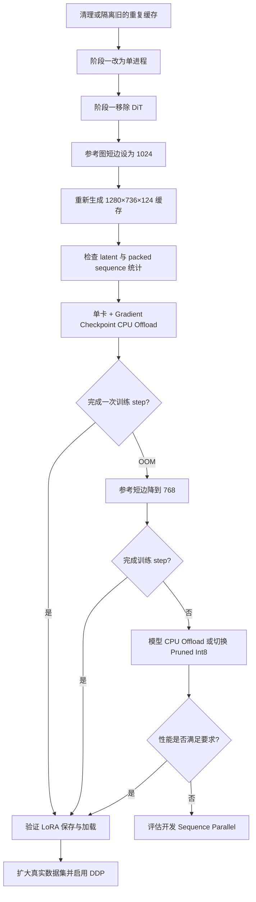

# MiniMax-H3 Ref2VA 1280×736×124 LoRA 训练显存优化方案

> 适用脚本：`examples/minimax_h3/model_training/lora/MiniMax-H3-Int8-ConvRot-Ref2VA-run.sh`
>
> 目标：使用 MiniMax-H3 Ref2VA Int8 ConvRot 底模，对 `1280×736×124` 音视频数据进行 LoRA 训练。
>
> 文档状态：方案评审稿。本文只整理诊断、选型和验证流程，不代表相关代码与脚本已经实施。

## 1. 结论

`1280×736×124` 在模型结构上是合法规格：

```text
1280 % 32 = 0
736  % 32 = 0
124  % 17 = 5
```

现有阶段一缓存已经证明目标视频可以完成 VAE 编码与 Ref2VA 序列构造。当前训练失败或显存不足的主要原因不是目标分辨率不受支持，而是阶段二的超长多模态序列、50 层 DiT 激活和约 34 GB Int8 底模叠加后逼近或超过单张 A800 80GB 的显存上限。

推荐优先采用以下组合：

```text
保持目标视频 1280×736×124
保持非 Pruned Int8 ConvRot Ref2VA 底模
参考图短边 2048 → 1024
开启 Gradient Checkpointing
开启 Gradient Checkpoint CPU Offload
阶段一单进程生成缓存且不加载 DiT
阶段二先单卡单步冒烟，再启动 8 卡 DDP
```

若推荐组合仍然 OOM，再按顺序尝试：

1. 将参考图短边由 1024 降为 768；
2. 启用模型参数 CPU Offload；
3. 业务允许时切换 Pruned Int8 ConvRot 底模；
4. 若必须保留全部条件质量与高吞吐，再为 MiniMax-H3 开发 Context/Sequence Parallel。

不推荐使用 ZeRO-3 直接加载当前预量化 Int8 ConvRot checkpoint。

## 2. 当前硬件与数据基线

### 2.1 硬件环境

当前节点资源：

| 资源 | 数量或容量 |
|---|---:|
| GPU | 8 × NVIDIA A800-SXM4-80GB |
| 单卡显存 | 80GB |
| 主机内存 | 1.0TiB |
| 当前可用主机内存 | 约 970GiB |
| 数据盘剩余空间 | 约 1.4TiB |

充足的主机内存使 Activation CPU Offload 和模型 CPU Offload 都具备实施条件，但 CPU/GPU 传输会降低训练速度。

### 2.2 当前测试数据

测试数据包含一条样本：

- 目标视频一段；
- 两张参考图；
- 一段参考音频；
- Prompt 约 4200 个字符。

两张参考图会分别进入两条通路：

```text
参考图
├── Video VAE → Reference Visual Anchor
└── Qwen3-VL → Visual Semantic Token
```

因此，参考图分辨率对序列长度的影响会近似出现两次：一次来自 VAE anchor，一次来自 Qwen3-VL 视觉语义 token。

## 3. 已生成缓存的实际张量

现有缓存已经是 `1280×736×124`，其主要张量如下：

| 内容 | 形状或数量 | 说明 |
|---|---:|---|
| 目标 Video latent | `[1, 24, 37, 46, 80]` | 736/16=46，1280/16=80 |
| 目标 Video token | 34,040 | `37×23×40` |
| Audio latent | `[2, 32, 207]` | 双声道，约 40 latent step/s |
| Reference visual anchor | `[12,480, 96]` | 两张参考图的 VAE token |
| Prompt embedding | `[15,590, 5,120]` | 含纯文本与 Qwen 视觉语义 token |
| Packed sequence | 62,976 | 向 64 对齐后的统一序列长度 |
| 单份缓存文件 | 约 171MB | 其中 Prompt embedding 占主要部分 |

序列组成如下：

| Token 类型 | 数量 |
|---|---:|
| 目标视频 | 34,040 |
| 参考图 VAE anchor | 12,480 |
| Qwen3-VL 参考图视觉语义 token | 12,484 |
| 纯文本 token | 3,106 |
| 参考与目标音频 | 828 |
| Padding | 38 |
| 总序列 | 62,976 |

参考图相关 token 接近 25,000，占总序列约 40%，是当前最值得优先优化的条件输入。

## 4. 阶段二显存为什么超过 80GB

### 4.1 底模权重

当前非 Pruned Int8 ConvRot Ref2VA checkpoint 文件约为 34GB。训练时还需要加载未量化层、LoRA 参数以及量化后端所需的 scale 和工作区，因此实际模型侧显存不会只等于 checkpoint 文件大小。

### 4.2 序列激活

MiniMax-H3 DiT 隐藏维度为 5376，当前 packed sequence 长度为 62,976。一个 BF16 隐藏状态的理论容量约为：

```text
62,976 × 5,376 × 2 bytes ≈ 0.63GiB
```

主干有 50 层。逐层 Gradient Checkpointing 虽然不保存每层内部全部中间结果，但仍需要保留各 checkpoint 边界输入，其理论量级约为：

```text
0.63GiB × 50 ≈ 31.5GiB
```

单层重计算时还会出现较大的临时张量：

| 临时张量 | 理论容量 |
|---|---:|
| QKV | 约 2.52GiB |
| MLP 中间激活 | 约 3.36GiB |

加上 LoRA 梯度和优化器状态、RoPE、AdaLN、输出、CUDA 工作区及内存碎片后，单卡峰值很容易超过 80GB。

### 4.3 Int8 主要减少权重，不减少 BF16 激活

Int8 ConvRot 能显著压缩冻结底模的线性层权重，但 Transformer 的输入、QKV、MLP 和残差激活仍主要以 BF16 计算。因此，序列越长，Int8 权重节省在总显存中的占比越低。

这也是为什么“已经使用 Int8”仍然可能在高分辨率 Ref2VA 训练中 OOM。

## 5. 推荐方案 A：保留非 Pruned 底模的平衡方案

### 5.1 方案目标

保持以下训练语义不变：

- 目标分辨率仍为 `1280×736`；
- 帧数仍为 124；
- 使用非 Pruned Int8 ConvRot Ref2VA 底模；
- LoRA rank 保持 32；
- 视频、音频都参与训练损失；
- DiT 仍采用全局联合注意力。

只调整参考条件的编码分辨率与 checkpoint 激活存放位置。

### 5.2 参考图短边从 2048 降到 1024

当前 Reference Encoder 默认将参考图短边放大到 2048。对于本样本的两张图，改为 1024 后预计：

| 指标 | 短边 2048 | 短边 1024 | 变化 |
|---|---:|---:|---:|
| 参考 VAE token | 12,480 | 约 3,104 | 约 -75% |
| Qwen 视觉 token | 12,484 | 约 3,108 | 约 -75% |
| Packed sequence | 62,976 | 约 44,224 | 约 -30% |
| 单层隐藏状态 | 0.63GiB | 约 0.44GiB | 约 -30% |
| 单层 QKV | 2.52GiB | 约 1.77GiB | 约 -30% |

这不会改变目标视频训练分辨率，只降低参考图作为条件时的细节密度。

对于人物、服装、商品、场景和风格参考，1024 短边通常仍能提供足够信息。需要精细文字、小 Logo 或局部纹理复制时，应通过验证集比较 1024 与 2048 的效果。

### 5.3 开启 Gradient Checkpoint CPU Offload

在普通 Gradient Checkpointing 基础上启用 checkpoint 激活 CPU offload：

```text
--use_gradient_checkpointing
--use_gradient_checkpointing_offload
```

其作用是：

```text
前向计算 checkpoint 边界激活
             ↓
将保存的激活转移至 CPU 内存
             ↓
反向时取回并重新计算层内部结果
```

优点：

- 直接降低长期驻留 GPU 的层边界激活；
- 当前主机拥有约 970GiB 可用内存，容量充足；
- 不改变模型结构、损失与 LoRA 格式。

代价：

- 增加 PCIe/NVLink 主机传输；
- 反向吞吐下降；
- CPU pinned memory 使用增加；
- 多个 DDP 进程同时 offload 时会竞争主机内存带宽。

### 5.4 保证使用内存高效 SDPA

当前 Python 环境没有独立的 Flash-Attention 2/3/4 包，但 PyTorch 自带 fused SDPA。已在 A800 上验证当前模型所需的 BF16、56 heads、head dimension 128 可以使用 Flash Attention 内核。

训练启动时应增加后端检查或日志，确认没有意外回退到显式数学注意力。对于 44K～63K 的序列，一旦构造完整注意力矩阵，显存会立刻失控。

### 5.5 控制 Prompt 长度

当前样本纯文本约为 3,106 token。建议数据侧控制在：

```text
推荐：512～1024 token
```

不建议程序静默截断 Prompt，因为截断可能破坏参考编号、声音说明或关键动作描述。更合适的做法是：

- 缓存阶段记录纯文本 token 数；
- 超过阈值时打印警告；
- 在数据制作与质检阶段压缩重复描述。

Prompt 缩短的显存收益小于参考图降采样，但能降低缓存体积、改善数据聚焦度。

## 6. 修正两阶段训练启动方式

### 6.1 阶段一必须显式单进程

当前脚本直接使用 `accelerate launch`。Accelerate 检测到 8 张 GPU 后自动启动了 8 个进程，而测试集只有一条样本。为补齐各 rank 的 DataLoader shard，结果生成了 8 份相同缓存：

```text
缓存数量：8
单份大小：约 171MB
总大小：约 1.3GB
```

阶段一建议固定：

```text
单 GPU
num_processes = 1
dataset_repeat = 1
```

正式缓存数量应与 metadata 样本数一致。

### 6.2 阶段一不应加载 DiT

数据缓存只需要：

- Qwen3-VL Text Encoder；
- Processor；
- Video VAE；
- Audio VAE。

DiT 不参与缓存计算。阶段一加载约 34GB 的 Int8 DiT 只会增加初始化时间与显存/内存占用，应从阶段一模型列表删除。

### 6.3 阶段二先单卡单步冒烟

在直接启动 8 卡长训练前，先使用：

```text
num_processes = 1
dataset_repeat = 1
num_epochs = 1
```

至少验证完成以下闭环：

1. Int8 DiT 与 LoRA 正确加载；
2. 一次条件前向完成；
3. 视频与音频 loss 都为有限值；
4. backward 完成；
5. optimizer step 完成；
6. LoRA checkpoint 成功保存；
7. checkpoint 能在验证脚本中重新加载。

### 6.4 真实训练再启用 DDP

8 卡 DDP 可以提高吞吐并增大全局 batch，但每个 rank 都会保存完整底模并独立处理一个样本：

```text
DDP：分数据、同步梯度
不分模型参数
不分单样本激活
```

因此，DDP 不能解决单卡无法容纳一个 1280×736×124 样本的问题。必须先让单卡峰值显存可控，再使用 DDP 扩展吞吐。

对于只有一个样本的测试集，不应启动 8 卡真实训练，否则各 rank 会反复训练同一个样本。

## 7. 方案 B：保留 2048 参考图的显存兜底方案

如果业务要求参考图短边保持 2048，可以依次启用：

1. Gradient Checkpoint CPU Offload；
2. 模型参数 CPU Offload；
3. 降低 DDP 进程数，减少并发 CPU 内存传输。

模型参数 CPU Offload 会逐层把冻结权重送到 GPU 执行，用完再移回 CPU。它能显著降低常驻 GPU 权重，但会反复传输大矩阵，训练速度通常明显下降。

适用场景：

- 目标是先保证训练能够运行；
- 数据量较小；
- 对训练耗时不敏感；
- 参考图高分辨率不可降低。

不建议同时默认开启模型 offload 和 8 个 DDP 进程。8 个进程会各自维护 offload 状态并争抢主机内存带宽，可能导致吞吐非常低。

## 8. 方案 C：切换 Pruned Int8 ConvRot 底模

仓库已有 Pruned Ref2VA Int8 ConvRot 训练与验证示例。Pruned 版本主要压缩时间步/AdaLN 相关的大型参数，能够显著降低模型权重占用。

普通版本每层 AdaLN 的主要映射规模约为：

```text
2688 → 96768
```

Pruned 版本将时间步表示压缩为很小的查表/插值表示，对应映射规模约为：

```text
8 → 96768
```

对于 50 层主干，这一变化可减少约百亿量级参数；按 Int8 粗略估算，可释放十余 GB 权重空间。

优点：

- 比模型 CPU Offload 更有利于训练吞吐；
- 可容纳更高参考分辨率或更长序列；
- 仓库已有相应训练和验证路径。

限制：

- Pruned 是不同底模变体；
- 训练和推理必须使用相同 Pruned 底模；
- LoRA 不应与非 Pruned 底模混用；
- 必须重新做效果基线和验证集对比。

如果业务允许改变底模，Pruned Int8 通常比全模型 CPU Offload 更适合长期训练。

## 9. 暂不推荐的方案

### 9.1 ZeRO-3 加载预量化 Int8 ConvRot

当前预量化 checkpoint 使用 Comfy-Kitchen 的量化 tensor、scale 和 ConvRot 元数据。ZeRO-3 初始化会把参数替换为分片或空形状占位参数，可能与预量化权重的完整 shape 和量化元数据恢复冲突。

典型报错表现为：

```text
checkpoint 中参数 shape 正常
当前模型参数 shape 为 [0]
```

所以当前 Int8 ConvRot 路径不建议直接使用 ZeRO-3。若需要 ZeRO-3，应优先采用 BF16 底模并重新评估显存，或专门开发兼容量化 tensor 的分片加载器。

### 9.2 ZeRO-2

ZeRO-2分片优化器状态和梯度，但不会分片：

- Int8 底模参数；
- 单样本 Transformer 激活。

LoRA 的优化器状态不是当前最大显存项，因此 ZeRO-2收益有限，不能替代参考序列缩减或 activation offload。

### 9.3 降低 LoRA Rank

LoRA rank 从 32 降为 16 可以减少 LoRA 参数、梯度和优化器状态，但不会减少主要的 DiT BF16 激活，也不会压缩 Int8 底模。

它可以作为最后几 GB 的辅助优化，不应作为核心方案。

### 9.4 Gradient Accumulation

当前训练 micro-batch 已经是 1。Gradient Accumulation 可以增大全局有效 batch，但不能降低单个样本的前向/反向峰值显存。

### 9.5 直接降低目标分辨率

降低目标视频分辨率确实能明显降低目标 video token，但本任务目标就是训练 `1280×736×124` 数据。应先优化参考条件与激活存储，不应把降低目标分辨率作为首选方案。

## 10. 需要开发的高性能方案：Context/Sequence Parallel

如果必须同时满足以下条件：

- 非 Pruned 底模；
- 参考图短边 2048；
- 不使用 Activation CPU Offload；
- 需要多卡共同承担同一个超长样本；
- 对训练吞吐有较高要求；

则需要为 MiniMax-H3 接入 Context/Sequence Parallel，而不是普通 DDP。

工程在其他模型中已有 xFuser/Ulysses 基础设施，但 MiniMax-H3 尚未接入。预计需要处理：

- packed 多模态序列按 rank 分片；
- 56 个 attention heads 与并行度的整除和 All-to-All；
- 3D RoPE、token tag、时间步索引同步分片；
- Reference 与 Target 位置映射；
- Video/Audio 双输出的 gather；
- 同一个训练样本向所有 sequence-parallel rank 分发；
- LoRA 梯度同步；
- Int8 ConvRot 量化线性层兼容性。

这属于独立开发任务，适合长期、大规模高分辨率训练，不是当前脚本增加几个参数即可完成的配置变更。

## 11. 方案对比

| 方案 | 目标视频质量 | 参考条件质量 | 显存收益 | 速度影响 | 改造成本 | 推荐级别 |
|---|---|---|---|---|---|---|
| 参考短边 1024 + Activation Offload | 不变 | 小幅影响 | 高 | 中等下降 | 低 | 首选 |
| 参考短边 768 + Activation Offload | 不变 | 中等影响 | 更高 | 中等下降 | 低 | OOM 后第二选择 |
| 保持 2048 + 模型 CPU Offload | 不变 | 不变 | 很高 | 明显下降 | 低到中 | 保真兜底 |
| Pruned Int8 底模 | 不变 | 可保持 | 很高 | 通常优于 offload | 中 | 可换底模时推荐 |
| LoRA rank 32 → 16 | 不变 | 不变 | 低 | 影响很小 | 低 | 辅助措施 |
| DDP | 不变 | 不变 | 不降低单卡峰值 | 提高吞吐 | 低 | 单卡跑通后使用 |
| ZeRO-2 | 不变 | 不变 | 低到中 | 有通信开销 | 中 | 非核心方案 |
| ZeRO-3 + 当前 Int8 | 不确定 | 不变 | 理论高 | 有通信开销 | 高且存在兼容问题 | 不推荐 |
| Context/Sequence Parallel | 不变 | 不变 | 很高 | 通信换显存 | 很高 | 长期方案 |

## 12. 推荐实施顺序



## 13. 实施后的验收标准

### 13.1 缓存阶段

- metadata 一条样本只生成一份缓存；
- 目标 Video latent 必须为 `[1, 24, 37, 46, 80]`；
- Packed sequence 统计被记录；
- 参考短边 1024 时，当前样本序列应接近 44K，而不是 63K；
- 缓存中不包含无用参数；
- 阶段一不加载 DiT。

### 13.2 训练阶段

- 单卡至少完成一次 forward、backward 和 optimizer step；
- Video loss、Audio loss 和总 loss 均为有限值；
- 峰值显存低于单卡容量，并保留合理安全余量；
- 没有回退到显式数学注意力导致的异常显存；
- 能保存只包含 LoRA 参数的 checkpoint；
- checkpoint 能在相同非 Pruned Int8 ConvRot Ref2VA 底模上重新加载。

### 13.3 多卡阶段

- 真实数据量不少于进程数，或明确接受 DistributedSampler 的补齐行为；
- 各 rank 使用不同数据 shard；
- 量化冻结权重不参与 DDP 参数同步；
- LoRA 梯度能够正确同步；
- 仅全局主进程写最终 checkpoint；
- DDP 吞吐优于单卡，且 CPU offload 不形成严重总线瓶颈。

## 14. 最终推荐配置

对于当前 8×A800 80GB 节点，建议以以下配置作为第一版实现目标：

| 项目 | 推荐值 |
|---|---|
| 目标分辨率 | `1280×736` |
| 帧数 | 124 |
| 底模 | 非 Pruned Ref2VA Int8 ConvRot |
| LoRA rank | 32 |
| Reference image short edge | 1024 |
| Gradient Checkpointing | 开启 |
| Gradient Checkpoint CPU Offload | 开启 |
| 阶段一进程数 | 1 |
| 阶段一是否加载 DiT | 否 |
| 冒烟测试进程数 | 1 |
| 正式训练 | 单卡跑通后再启用 8 卡 DDP |
| CFG-aware training | 首轮保持 1.0，避免额外 unconditional 前向 |
| 模型 CPU Offload | 默认关闭，OOM 时兜底开启 |
| ZeRO-3 | 当前 Int8 checkpoint 不启用 |

该配置优先保证训练语义和目标视频分辨率不变，同时针对当前真正的显存来源——参考条件序列与 checkpoint 激活——进行优化。

## 15. 配套文档

- 模型结构与训练原理：[`minimax-h3-architecture-and-training.md`](./minimax-h3-architecture-and-training.md)
- Ref2VA 全参、LoRA 与分布式训练指南：[`ref2va-training-guide.md`](./ref2va-training-guide.md)
- Ref2VA 数据采集与制作规范：[`ref2va-data-specification.md`](./ref2va-data-specification.md)

