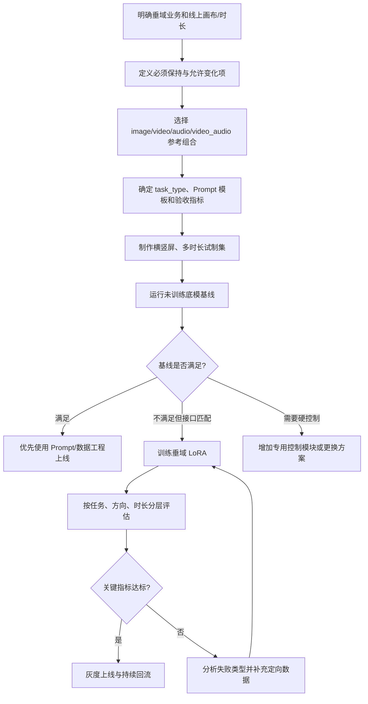

# MiniMax-H3 Ref2VA 垂域多模态参考生视频 LoRA 技术方案选型

> 文档用途：帮助产品、算法、数据和交付团队判断业务需求是否适合使用 MiniMax-H3 Ref2VA LoRA，并确定参考输入、数据任务类型、训练规格和验收指标。
>
> 适用范围：当前 DiffSynth-Studio 中的 MiniMax-H3 Ref2VA 音视频联合生成与 LoRA 训练实现。
>
> 重要说明：本文中的“支持”分为“工程接口可接收”和“经过垂域数据训练后有望形成业务能力”两层。接口支持不等于未经验证即可承诺业务效果。

## 1. 选型结论

MiniMax-H3 Ref2VA 适合以下类型的垂域方案：

- 使用一张或多张参考图保持人物、角色、商品、服装、场景或视觉风格；
- 使用参考视频提供主体、动作、运镜、构图、节奏或待改写的源内容；
- 使用参考音频提供说话人音色、对白风格、音乐、环境声或节奏；
- 同时使用图像、视频和音频参考，生成同步的目标视频与目标音频；
- 通过 LoRA 强化特定行业的主体外观、场景分布、镜头语言、声音风格和“参考条件如何作用于结果”的映射。

以下需求不能只凭当前 Ref2VA LoRA 方案直接承诺：

- 源视频逐像素、逐帧不变，只修改指定局部区域；
- 用 mask、关键点、骨骼、深度图、轨迹或相机参数进行硬控制；
- 人脸、Logo、包装文字或 UI 文案百分之百无误；
- 毫秒级口型同步或指定音乐片段逐采样点无损复制；
- 多个参考主体之间自动建立无歧义绑定；
- 仅通过增加 GPU 数量就分摊单个超长样本的激活显存。

如果业务核心要求是“语义级参考和联合音视频生成”，Ref2VA LoRA 是合适候选；如果核心要求是“像素级编辑、结构硬控制或严格身份认证”，需要叠加专用控制模块、后处理或选择其他架构。

## 2. 框架原生输入输出能力

### 2.1 输入和输出契约

```text
Prompt
  + 1～N 个 Reference
      ├── image
      ├── video
      ├── audio
      └── video_audio
                  ↓
       MiniMax-H3 Ref2VA DiT
                  ↓
        Target Video + Target Audio
```

当前训练目标是联合生成目标画面和目标声音。目标视频必须携带与画面同步的目标声轨；即使业务主要关注视觉，也应明确静音、环境底噪或实际声音的制作策略。

### 2.2 四种参考块

| 参考类型 | 工程字段 | 可提供的主要条件 | 不会自动提供的内容 |
|---|---|---|---|
| 参考图像 | `image` | 身份、外观、商品结构、服装、材质、场景、构图、风格 | 时间动作、源声轨 |
| 无声参考视频 | `video` | 动作、运镜、节奏、构图、动态外观、源视频语义 | 文件中的声轨不会作为条件使用 |
| 参考音频 | `audio` | 音色、说话方式、音乐、环境声、节奏 | 视觉身份和画面结构 |
| 带声参考视频 | `video_audio` | 同一素材的画面动态与同步声轨 | 不代表目标会逐帧、逐采样点复制 |

单条样本可以混合多种参考。工程按 Picture、Video、Audio 三种模态分别编号；`video_audio` 同时占用一个 Video 编号和一个 Audio 编号。

### 2.3 LoRA 实际学习的内容

当前推荐 LoRA 作用于 DiT 的注意力和 MLP：

```text
attn.qkv_proj
attn.out_proj
mlp.fc1
mlp.fc2
```

Text Encoder、Video VAE 和 Audio VAE 在标准 LoRA 流程中保持冻结，训练目标集中在 DiT。默认视频 loss 与音频 loss 同时参与，`audio_loss_weight=1.0`；如果设为 0，只是不计音频 loss，音频流仍会进入模型前向。

因此 LoRA 更适合学习：

- 垂域视觉与声音的联合分布；
- Prompt、参考素材与目标结果之间的映射规则；
- 特定人物/角色/商品的外观一致性倾向；
- 特定行业的场景、镜头、动作、风格和声音组合；
- 图像、视频、音频参考在生成过程中的使用习惯。

LoRA 不会新增当前模型不存在的输入接口，也不会把软参考自动变成几何或像素级硬约束。`task_type` 只是数据管理字段，当前代码不会根据它切换网络分支或 loss。

## 3. 支持的业务任务类型

下面的“支持等级”表示与当前接口和 LoRA 训练方式的匹配程度，不代表未经数据验证的最终质量。

| 任务类型 | 典型业务 | 推荐参考组合 | LoRA 适配度 | 主要验收点 | 关键风险 |
|---|---|---|---:|---|---|
| 人物/角色参考生视频 | 数字人、IP 角色、服饰模特、短剧角色 | 1～3 张人物图，可加动作视频和音色音频 | 高 | 身份、发型、服装、年龄感、时序稳定 | 大姿态、遮挡和远景可能导致身份漂移 |
| 商品参考生广告 | 电商商品、汽车、家电、包装、珠宝 | 商品多角度图，可加动作/运镜视频 | 高 | 商品结构、材质、配色、Logo 区域、镜头完整性 | 小字、Logo 和精密几何不能保证逐像素准确 |
| 垂域视觉风格生成 | 国风、动漫、奢侈品、工业、医疗科普、教育内容 | 风格图像或风格视频 | 高 | 色彩、光影、材质、场景和镜头语言 | 风格过拟合、内容多样性下降 |
| 动作与运镜参考 | 舞蹈、展示动作、产品转台、镜头模板 | `video` | 中高 | 动作阶段、节奏、镜头方向和主体完整性 | 不是姿态骨骼硬控制，复杂动作可能偏离 |
| 参考视频语义改写 | 换主体、换场景、换风格、改对白 | `video` 或 `video_audio`，可加图像/音频 | 中高 | 源内容保留范围与修改范围 | 不是 mask 编辑，不能承诺背景或局部逐帧不变 |
| 人声音色参考与对白生成 | 数字人播报、角色对白、营销口播 | 人物图/视频 + `audio` | 中 | 说话人相似度、ASR 正确率、口型同步 | 音色克隆、韵律和口型需专项数据与授权 |
| 音乐/节奏驱动画面 | MV、舞蹈、节拍剪辑、品牌音乐视觉化 | `audio`，可加人物/风格图 | 中高 | 节拍、动作事件、镜头切换与音乐同步 | 不保证原音频无损复制；长音乐需切片设计 |
| 音画联合源内容改写 | 保留源动作和声场，替换主体或场景 | `video_audio` + 图像 | 中高 | 画面与声音同步、保留关系准确 | 参考过强会导致目标退化为复制，过弱会丢失同步 |
| 多参考组合生成 | 多人物、多商品、人物+服饰+动作+声音 | 两种以上参考模态 | 中 | 每项参考是否被正确使用，主体绑定是否清楚 | 参考越多，歧义、序列长度和显存越高 |
| 场景/环境声参考生成 | 旅游、工业现场、自然环境、空间氛围 | 场景图/视频 + 环境音频 | 中高 | 场景语义、声场、关键事件同步 | 空间声场和镜头位置不属于显式几何控制 |

## 4. 建议的数据任务枚举

数据生产中的 `task_type` 建议使用以下枚举，以便统计、抽样和分任务评估：

| `task_type` | 业务定义 | 必需参考 | 可选参考 |
|---|---|---|---|
| `image_reference` | 通用单图或多图参考生成 | `image` | 其他图像、`video`、`audio` |
| `identity_animation` | 保持人物或角色身份并生成新动作/场景 | `image` | `video`、`audio` |
| `product_showcase` | 保持商品外观并生成展示或广告视频 | `image` | `video`、风格 `image` |
| `style_reference` | 参考视觉风格生成新的音视频内容 | `image` 或 `video` | `audio` |
| `video_motion_reference` | 参考动作、节奏或运镜 | `video` | `image`、`audio` |
| `video_edit` | 对源视频做语义级视觉改写 | `video` | `image`、`audio` |
| `video_edit_audio_reuse` | 同时参考源画面和源声轨 | `video_audio` | `image` |
| `video_edit_voice_reference` | 源视频改写并使用另一段人声音色 | `video_audio` + `audio` | `image` |
| `voice_reference` | 使用参考音色生成目标对白 | `audio` | 人物 `image`/`video` |
| `music_reference` | 复用或参考音乐内容 | `audio` | `image`、`video` |
| `audio_driven_visual` | 根据声音事件或节拍生成视觉内容 | `audio` | `image`、`video` |
| `multi_reference_composition` | 两种以上模态共同定义结果 | 至少两个参考块 | 任意合法组合 |
| `scene_ambience_reference` | 参考场景和环境声生成 | `image`/`video` + `audio` | 其他参考 |

不建议把“行业名称”直接当成任务类型。例如“电商”“文旅”“医疗”是 `domain`，而“商品参考展示”“场景风格参考”“人物口播”才是模型需要学习的任务关系。元数据可以同时保留：

```json
{
  "domain": "ecommerce",
  "task_type": "product_showcase"
}
```

## 5. 从业务需求反推参考组合

业务立项时先回答“什么必须保持、什么允许变化、什么必须同步”。

| 业务要求 | 首选参考 | Prompt 必须说明 |
|---|---|---|
| 保持人物/角色身份 | 多角度 `image` | 身份、发型、服装和允许变化项 |
| 保持商品结构和材质 | 商品 `image` | 必须保留的结构、颜色、纹理、Logo 区域 |
| 复用动作或运镜 | `video` | 参考动作、镜头和不需要复制的内容 |
| 基于源视频做改写 | `video` | `fully_preserved`、`partially_preserved`、`replace`、`remove` |
| 保留源视频声轨 | `video_audio` | 哪些声音完整复用或部分复用 |
| 使用指定人声音色 | `audio` | 说话人、语言、逐字对白、语气和音量 |
| 根据音乐节拍生成 | `audio` | 音乐来源、节拍事件、动作和镜头同步点 |
| 同时约束主体、动作和声音 | `image + video + audio` | 每个参考的独立职责，避免相互冲突 |

参考块建议控制在 1～3 个。只有在业务确实需要且完成消融验证后才增加到 4 个；参考越多不等于控制越强，反而可能增加条件歧义和显存压力。

## 6. 垂域 LoRA 组织方式

### 6.1 单一 LoRA 适用场景

可以训练一个统一 LoRA 的情况：

- 任务都属于同一行业和相近视觉/声音分布；
- 参考关系一致，例如都是“商品图 → 商品广告视频”；
- Prompt 模板和验收指标统一；
- 横屏和竖屏内容语义一致，只是画布方向不同；
- 不同任务之间不存在明显冲突。

### 6.2 建议拆分 LoRA 的情况

- 人物身份 LoRA 与商品/场景 LoRA 的目标完全不同；
- 一个任务要求强保留源视频，另一个任务要求大幅重构；
- 写实、动漫、UI、工业等数据分布差异过大；
- 不同客户、品牌、人物或版权范围必须物理隔离；
- 音色克隆与纯视觉风格任务的数据和指标完全不同；
- 一个任务需要 5 秒短片，另一个任务长期使用 15 秒高动态视频，训练资源配置差异很大。

当前 `task_type` 不会自动路由不同 adapter。如果把相互冲突的任务直接混入同一个 LoRA，只能依赖 Prompt 学习区分，效果和稳定性需要单独验证。

### 6.3 数据比例建议

首轮试验建议采用：

```text
60%～70%  核心业务任务
20%～30%  同域多样化和边界场景
10%～20%  困难样本、长尾主体与失败模式修复
```

如果同时支持横屏和竖屏，应按实际线上流量确定比例；在业务比例未知时可先按 1:1 制作试制集。训练、验证和测试都必须同时包含两个方向，不能只用横屏训练、竖屏上线。

## 7. 横竖屏与 5～15 秒规格

### 7.1 画布规格

| 方向 | 宽×高 | 训练参数 | 状态 |
|---|---:|---|---|
| 横屏 | `1280×736` | `--width 1280 --height 736` | 支持 |
| 竖屏 | `736×1280` | `--width 736 --height 1280` | 支持 |

两个尺寸都能被 32 整除，且像素总量相同。不得把竖屏写成 `1280×736` 后依赖 rotation metadata；必须真正编码为 `736×1280` 像素。

当前阶段一缓存命令一次只接受一组 `height/width`。横屏和竖屏应分别生成缓存，再在阶段二按训练方案组合。不要用横屏参数读取竖屏素材，否则会发生中心裁剪并丢失主体。

### 7.2 合法帧数

24 FPS 下，MiniMax-H3 目标帧数必须满足：

```text
num_frames = 17n + 5
```

5～15 秒范围内的合法训练帧数如下：

| 帧数 | 时长 | 帧数 | 时长 |
|---:|---:|---:|---:|
| 124 | 5.167 秒 | 243 | 10.125 秒 |
| 141 | 5.875 秒 | 260 | 10.833 秒 |
| 158 | 6.583 秒 | 277 | 11.542 秒 |
| 175 | 7.292 秒 | 294 | 12.250 秒 |
| 192 | 8.000 秒 | 311 | 12.958 秒 |
| 209 | 8.708 秒 | 328 | 13.667 秒 |
| 226 | 9.417 秒 | 345 | 14.375 秒 |

精确 5.000 秒的 120 帧和精确 15.000 秒的 360 帧都不满足模型约束。数据合同可以写“名义时长 5～15 秒”，但训练成品必须使用上表中的合法帧数。推荐首期使用四个时长桶：

```text
124 帧  ≈ 5.17 秒
192 帧  = 8.00 秒
260 帧  ≈ 10.83 秒
345 帧  ≈ 14.38 秒
```

若业务必须覆盖接近 15 秒，使用 345 帧；若必须超过或等于 15 秒，下一合法规格是 362 帧（约 15.083 秒），它已经超出本项目“最多 15 秒”的交付范围，需要单独审批。

### 7.3 训练成本提示

时长增加会近似线性增加目标视频 token 和激活显存。以 `1280×736` 或 `736×1280` 为例，仅目标视频 token 约为：

| 帧数 | Video latent 时间长度 | 目标视频 token |
|---:|---:|---:|
| 124 | 37 | 34,040 |
| 192 | 57 | 52,440 |
| 260 | 77 | 70,840 |
| 345 | 102 | 93,840 |

参考图、参考视频、Prompt 和音频 token 还会继续叠加。因此“数据支持 15 秒”不等于当前 80GB 单卡配置一定能直接训练 15 秒样本。10～15 秒任务应单独进行显存验证，并优先使用参考图降采样、Gradient Checkpoint CPU Offload、Pruned/量化底模或 Sequence Parallel。

### 7.4 建议的缓存与训练分桶

```text
orientation
├── landscape_1280x736
│   ├── frames_124
│   ├── frames_192
│   ├── frames_260
│   └── frames_345
└── portrait_736x1280
    ├── frames_124
    ├── frames_192
    ├── frames_260
    └── frames_345
```

阶段一按方向和帧数分别生成缓存。阶段二可以在验证显存和数据采样策略后训练统一 LoRA，但当前工程没有专门的长宽/时长 bucket sampler；多卡训练时，不同 rank 遇到不同长度会由最长样本决定该步速度。生产方案应避免完全随机混合极短和极长样本。

## 8. 业务选型决策表

| 问题 | 是 | 否 |
|---|---|---|
| 结果需要同时生成画面和声音吗？ | 继续评估 Ref2VA | 若只需静音视觉，可评估视觉模型或明确静音策略 |
| 参考关系能用图像/视频/音频表达吗？ | 继续 | 若依赖 mask、姿态或深度硬控制，需要其他模块 |
| 可以接受语义级保留而非像素级复制吗？ | 继续 | 选择专用视频编辑/重绘方案 |
| 有足够的“参考—Prompt—目标”成对数据吗？ | 适合 LoRA | 先建设数据或采用零样本方案验证 |
| 验收指标能明确量化吗？ | 进入试制 | 先定义身份、商品、动作、声音和同步指标 |
| 5～15 秒长视频显存预算已验证吗？ | 可规划长时训练 | 先从 124 帧试制和训练闭环开始 |

建议先用 50～200 条覆盖核心任务、横竖屏和关键时长档位的试制集做零样本基线，再用 500～2000 条训练首版 LoRA。是否扩大数据规模应由失败类型决定，而不是只看训练 loss。

## 9. 评估指标建议

| 能力 | 自动指标建议 | 人工验收重点 |
|---|---|---|
| Prompt 遵循 | VLM 问答/属性命中率 | 主体、动作、镜头、声音是否完整出现 |
| 人物身份 | 人脸/人物 embedding 相似度 | 年龄感、五官、发型、服装和跨帧稳定性 |
| 商品一致性 | DINO/CLIP、局部特征相似度 | 结构、材质、颜色、Logo 区域和几何稳定性 |
| 动作与运镜 | 姿态序列、光流或轨迹相似度 | 动作阶段、节奏、方向和镜头连续性 |
| 视频编辑保留 | 源目标相似度、背景变化率 | 该保留的是否保留、该替换的是否替换 |
| 对白 | ASR WER/CER | 逐字内容、说话人、语气和停顿 |
| 音色 | speaker similarity | 音色自然度、跨句稳定性、无串音 |
| 口型同步 | SyncNet 类指标 | 音节、开闭口、停顿和遮挡 |
| 音乐/节拍同步 | beat-event 对齐率 | 动作、转场和音乐强拍是否对应 |
| 音视频质量 | VMAF/无参考质量、响度和削波 | 闪烁、畸变、噪声、声画同步和结尾完整性 |

任何自动指标都不能替代对目标、所有参考和 Prompt 的联合人工审核。

## 10. 推荐落地流程



## 11. 配套文档

- 数据采集、标注与交付：[`ref2va-data-specification.md`](./ref2va-data-specification.md)
- 全参、LoRA 与分布式训练：[`ref2va-training-guide.md`](./ref2va-training-guide.md)
- 模型结构与训练原理：[`minimax-h3-architecture-and-training.md`](./minimax-h3-architecture-and-training.md)
- 1280×736 显存优化：[`ref2va-1280x736-memory-optimization.md`](./ref2va-1280x736-memory-optimization.md)
