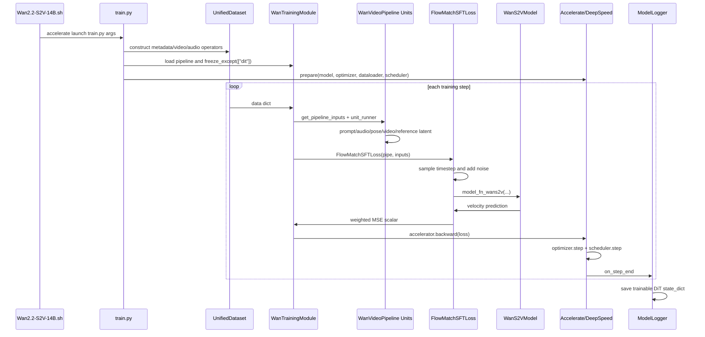

# Wan2.2 S2V Training Source Code Analysis

本文档按照 `整理流程.md` 的规则整理，目标是帮助开发者基于源码理解当前工作区里 `Wan2.2-S2V-14B` 的完整训练链路。文档不复述泛化的扩散模型概念，而是把每个结论落到本仓库中的文件、类、函数、调用关系和 tensor shape。

分析范围以当前训练脚本为主：

```text
examples/wanvideo/model_training/full/Wan2.2-S2V-14B.sh
examples/wanvideo/model_training/train.py
diffsynth/pipelines/wan_video.py
diffsynth/models/wan_video_dit_s2v.py
diffsynth/models/wav2vec.py
diffsynth/diffusion/loss.py
diffsynth/diffusion/flow_match.py
diffsynth/diffusion/runner.py
```

当前脚本做的是 full fine-tuning 风格的 SFT 训练：只训练 `pipe.dit`，冻结 VAE、T5 text encoder、wav2vec audio encoder 等辅助模块；loss 使用 `FlowMatchSFTLoss`；分布式由 Accelerate + DeepSpeed ZeRO-2 托管。

## 1. 项目整体架构

### 1.1 训练对象

训练对象是 Wan2.2 S2V 的 DiT：

```text
WanS2VModel
  file: diffsynth/models/wan_video_dit_s2v.py
  config: diffsynth/configs/model_configs.py
  registered as: pipe.dit
```

模型配置在 `diffsynth/configs/model_configs.py` 的 Wan S2V 条目中：

```text
dim = 5120
in_dim = 16
out_dim = 16
text_dim = 4096
freq_dim = 256
ffn_dim = 13824
patch_size = (1, 2, 2)
num_heads = 40
num_layers = 40
cond_dim = 16
audio_dim = 1024
num_audio_token = 4
```

### 1.2 模块关系图

```text
WanTrainingModule
|
+-- WanVideoPipeline
|   |
|   +-- scheduler: FlowMatchScheduler("Wan")
|   +-- tokenizer: HuggingfaceTokenizer
|   +-- text_encoder: WanTextEncoder              frozen
|   +-- audio_encoder: WanS2VAudioEncoder         frozen
|   +-- vae: WanVideoVAE                          frozen
|   +-- dit: WanS2VModel                          trainable
|   +-- units: PipelineUnit list
|
+-- UnifiedDataset
|   |
|   +-- video loader
|   +-- pose video loader
|   +-- audio loader
|   +-- metadata prompt
|
+-- launch_training_task
    |
    +-- DataLoader
    +-- FlashAdamW or AdamW
    +-- ConstantLR
    +-- Accelerator.prepare
    +-- DeepSpeed engine
    +-- ModelLogger checkpoint
```

### 1.3 完整训练 Sequence Diagram



## 2. 项目目录结构

与 Wan2.2 S2V 训练直接相关的目录如下：

```text
examples/wanvideo/model_training/
  train.py                         # 通用 Wan 训练入口
  full/Wan2.2-S2V-14B.sh            # 本文主训练脚本
  full/accelerate_config_14B.yaml   # DeepSpeed/Accelerate 配置
  validate_full/Wan2.2-S2V-14B.py   # 独立验证脚本

diffsynth/core/data/
  unified_dataset.py                # metadata dataset
  operators.py                      # LoadVideo/LoadAudio/ImageCropAndResize

diffsynth/diffusion/
  runner.py                         # training loop
  training_module.py                # freeze/lora/split/export base logic
  loss.py                           # FlowMatchSFTLoss
  flow_match.py                     # FlowMatchScheduler
  base_pipeline.py                  # BasePipeline/PipelineUnitRunner
  logger.py                         # checkpoint and logs

diffsynth/pipelines/
  wan_video.py                      # WanVideoPipeline and S2V pipeline unit

diffsynth/models/
  wan_video_dit_s2v.py              # S2V DiT, audio injection, motion packer
  wan_video_dit.py                  # shared attention/block/head utilities
  wav2vec.py                        # WanS2VAudioEncoder
  wan_video_vae.py                  # Wan VAE

diffsynth/configs/
  model_configs.py                  # model hash -> class/config registry
```

## 3. 训练入口

### 3.1 模块作用

入口脚本负责把数据路径、模型路径、训练超参、分布式配置传给 `train.py`。真正的训练逻辑不在 shell 中，而在 `examples/wanvideo/model_training/train.py` 和 `diffsynth/diffusion/runner.py`。

### 3.2 对应源码位置

```text
examples/wanvideo/model_training/full/Wan2.2-S2V-14B.sh
  -> /app/miniconda3/bin/accelerate launch
  -> examples/wanvideo/model_training/train.py
  -> wan_parser()
  -> accelerate.Accelerator(...)
  -> UnifiedDataset(...)
  -> WanTrainingModule(...)
  -> ModelLogger(...)
  -> launch_training_task(...)
```

### 3.3 启动参数含义

核心参数：

```text
--dataset_base_path data/diffsynth_example_dataset/wanvideo/Wan2.2-S2V-14B
--dataset_metadata_path data/diffsynth_example_dataset/wanvideo/Wan2.2-S2V-14B/metadata.csv
--data_file_keys "video,input_audio,s2v_pose_video"
--height 576
--width 768
--num_frames 241
--dataset_repeat 100
--trainable_models "dit"
--extra_inputs "input_image,input_audio,s2v_pose_video"
--use_gradient_checkpointing_offload
--customized_optimizer "flashoptim.FlashAdamW"
```

关键行为：

- `data_file_keys` 中的 `video` 和 `s2v_pose_video` 会走视频加载、裁剪、缩放。
- `input_audio` 在 `special_operator_map` 中走 `LoadAudio(sr=16000)`。
- `extra_inputs` 中的 `input_image` 在 `WanTrainingModule.parse_extra_inputs()` 里不是从 metadata 读图，而是取 `data["video"][0]` 作为首帧 reference。
- `trainable_models="dit"` 让 `pipe.freeze_except(["dit"])` 只开放 S2V DiT 梯度。
- `task` 未显式传入，默认是 `sft`，所以 loss 是 `FlowMatchSFTLoss`。

### 3.4 常见坑

- `num_frames` 必须满足 Wan pipeline 的时间约束：`num_frames % 4 == 1`。本脚本的 `241` 满足。
- `height` 和 `width` 必须能被 16 整除。`576` 和 `768` 满足。
- `input_image` 在训练里来自目标视频第一帧，若想使用独立 reference image，需要改 `parse_extra_inputs()` 和 metadata 结构。
- `customized_optimizer="flashoptim.FlashAdamW"` 要求环境中可 import `flashoptim`，否则会在 `get_optimizer_class()` 失败。

## 4. Config 配置系统

### 4.1 模块作用

训练配置分三层：

```text
Shell args
  -> argparse Namespace
  -> WanTrainingModule / UnifiedDataset / runner

Accelerate yaml
  -> Accelerator state
  -> DeepSpeed engine

Model registry
  -> ModelConfig
  -> ModelPool.auto_load_model
  -> pipeline modules
```

### 4.2 对应源码位置

```text
examples/wanvideo/model_training/train.py
  -> wan_parser()
  -> add_general_config(...)
  -> add_video_size_config(...)
  -> WanTrainingModule.__init__(...)

diffsynth/diffusion/training_module.py
  -> parse_model_configs()
  -> parse_path_or_model_id()
  -> switch_pipe_to_training_mode()

diffsynth/configs/model_configs.py
  -> Wan-AI/Wan2.2-S2V-14B entries
```

### 4.3 ModelConfig 解析流程

脚本传入：

```text
Wan-AI/Wan2.2-S2V-14B:diffusion_pytorch_model*.safetensors
Wan-AI/Wan2.2-S2V-14B:wav2vec2-large-xlsr-53-english/model.safetensors
Wan-AI/Wan2.2-S2V-14B:models_t5_umt5-xxl-enc-bf16.pth
Wan-AI/Wan2.2-S2V-14B:Wan2.1_VAE.pth
```

`DiffusionTrainingModule.parse_path_or_model_id()` 以最后一个 `:` 切分为：

```text
model_id = Wan-AI/Wan2.2-S2V-14B
origin_file_pattern = corresponding file pattern
```

然后 `WanVideoPipeline.from_pretrained()` 调用 `download_and_load_models()`，由 `ModelPool` 根据 state dict hash 和 `model_configs.py` 里的 registry 自动识别类：

```text
diffusion_pytorch_model*.safetensors
  -> diffsynth.models.wan_video_dit_s2v.WanS2VModel

wav2vec2-large-xlsr-53-english/model.safetensors
  -> diffsynth.models.wav2vec.WanS2VAudioEncoder

models_t5_umt5-xxl-enc-bf16.pth
  -> diffsynth.models.wan_video_text_encoder.WanTextEncoder

Wan2.1_VAE.pth
  -> diffsynth.models.wan_video_vae.WanVideoVAE
```

### 4.4 训练模式配置

`WanTrainingModule.__init__()` 中：

```text
pipe.scheduler.set_timesteps(1000, training=True)
pipe.freeze_except(["dit"])
```

效果：

- Scheduler 进入训练模式，并生成 1000 个 Wan flow matching timesteps。
- 整个 pipeline 先 `eval()` 且 `requires_grad_(False)`。
- `pipe.dit` 再 `train()` 且 `requires_grad_(True)`。

### 4.5 可以修改的位置

```text
修改模型来源:
  examples/wanvideo/model_training/full/Wan2.2-S2V-14B.sh

修改模型识别和默认构造参数:
  diffsynth/configs/model_configs.py

修改训练/冻结策略:
  diffsynth/diffusion/training_module.py
  examples/wanvideo/model_training/train.py

修改任务到 loss 的映射:
  examples/wanvideo/model_training/train.py
  WanTrainingModule.task_to_loss
```

## 5. Dataset

### 5.1 模块作用

Dataset 把 metadata 中的一行样本变成训练 step 可用的 Python dict。

输入：

```text
metadata row:
  video
  s2v_pose_video
  input_audio
  prompt
```

输出：

```text
{
  "video": list[PIL.Image],
  "s2v_pose_video": list[PIL.Image],
  "input_audio": np.ndarray,
  "prompt": str
}
```

### 5.2 对应源码位置

```text
examples/wanvideo/model_training/train.py
  -> UnifiedDataset(...)

diffsynth/core/data/unified_dataset.py
  -> UnifiedDataset.__init__()
  -> UnifiedDataset.default_video_operator()
  -> UnifiedDataset.load_metadata()
  -> UnifiedDataset.__getitem__()

diffsynth/core/data/operators.py
  -> ToAbsolutePath
  -> LoadVideo
  -> LoadAudio
  -> ImageCropAndResize
```

### 5.3 调用链

```text
DataLoader.__iter__()
  -> UnifiedDataset.__getitem__(data_id)
     -> metadata row copy
     -> for key in data_file_keys
        -> input_audio: ToAbsolutePath >> LoadAudio(sr=16000)
        -> video: default_video_operator
        -> s2v_pose_video: default_video_operator
  -> collate_fn=lambda x: x[0]
  -> WanTrainingModule.forward(data)
```

### 5.4 代码流程

`UnifiedDataset.default_video_operator()` 为视频路径构造：

```text
str path
  -> ToAbsolutePath(base_path)
  -> RouteByExtensionName
  -> LoadVideo(num_frames=241, time_division_factor=4, time_division_remainder=1)
  -> ImageCropAndResize(height=576, width=768, division=16)
  -> list[PIL.Image]
```

`LoadVideo.get_num_frames()` 的行为：

- 如果原视频帧数大于等于 `num_frames`，取 `num_frames`。
- 如果原视频帧数不足，则向下截断到满足 `T % 4 == 1` 的长度。

`ImageCropAndResize.crop_and_resize()` 的行为：

- 先按覆盖目标框的比例 resize。
- 再 center crop 到目标尺寸。

### 5.5 Tensor Shape Flow

Dataset 阶段还没有 tensor，主要是 Python 对象：

```text
video path
  -> list[PIL.Image], len=241, each size=(768, 576), RGB

s2v_pose_video path
  -> list[PIL.Image], len=241, each size=(768, 576), RGB

input_audio path
  -> np.ndarray, sample_rate=16000

prompt column
  -> str
```

### 5.6 为什么这样设计

- 视频和 pose 视频共用 `default_video_operator()`，保证二者帧数和空间尺寸一致。
- 音频单独走 `special_operator_map`，避免被默认视频 operator 误处理。
- `collate_fn=lambda x: x[0]` 直接返回单条 dict，避免 PyTorch 默认 collate 尝试堆叠 PIL 和变长对象。

### 5.7 可以修改的位置

```text
增加新的 metadata 字段:
  examples/wanvideo/model_training/train.py
  -> data_file_keys
  -> special_operator_map
  -> WanTrainingModule.parse_extra_inputs()

修改视频采样:
  diffsynth/core/data/operators.py
  -> LoadVideo
  -> FrameSamplerByRateMixin

强制按 16fps 读取训练视频:
  examples/wanvideo/model_training/train.py
  -> UnifiedDataset.default_video_operator(..., frame_rate=16, fix_frame_rate=True)
  或离线预处理 video / s2v_pose_video 到 16fps

修改裁剪策略:
  diffsynth/core/data/operators.py
  -> ImageCropAndResize.crop_and_resize()
```

### 5.8 常见坑

- metadata 中 `s2v_pose_video` 的帧数不足时会被截断或补齐，最终可能和预期 pose 对齐不同。
- `LoadAudio` 只返回 waveform，不返回 sample rate；训练中默认使用 `audio_sample_rate=16000`。
- DataLoader 默认 `batch_size=1`，如果手动改 batch size，`collate_fn=lambda x: x[0]` 会丢掉 batch 内其他样本。

### 5.9 输入视频 fps 与音画同步

当前训练代码**没有自动保证输入视频是 16fps**。主视频和 pose 视频的读取来自 `UnifiedDataset.default_video_operator()`，其默认参数是：

```text
frame_rate = 24
fix_frame_rate = False
```

而 `FrameSamplerByRateMixin.map_single_frame_id()` 中：

```text
if not fix_frame_rate:
  return new_sequence_id
```

因此在当前默认训练脚本下，视频 loader 实际按原始帧序号读取：

```text
0, 1, 2, ..., num_frames - 1
```

不会按 16fps 重新采样。`frame_rate` 只有在 `fix_frame_rate=True` 时才会参与：

```text
target_time = new_sequence_id / frame_rate
raw_frame_index = round(target_time * raw_frame_rate)
```

但是 S2V 音频分支默认按 `fps=16` 生成音频条件：

```text
WanVideoUnit_S2V.process_audio(fps=16)
  -> get_audio_feats_per_inference(..., fps=16, batch_frames=num_frames-1)
```

这意味着代码假设：

```text
num_frames - 1 个待生成视频帧
  对应 16fps 的时间轴
```

以 `num_frames=241` 为例：

```text
首帧 = reference image
后续 240 帧 = 240 / 16 = 15 秒
```

如果原视频是 30fps，但 loader 直接取前 241 帧，则目标视频时长约 8 秒；音频条件却按 15 秒切取和采样，口型会系统性错位。源码只保证 shape 对齐，不会自动修复真实时间轴错位。

口型同步依赖下面这些条件同时成立：

```text
训练样本本身音画同步
video 已按 16fps 时间轴排列
s2v_pose_video 与 video 同帧对齐
input_audio 来自同一片段、同一起点
num_frames 与音频片段时长匹配
```

满足这些条件后，代码里的同步链路是：

```text
video[0]                      -> clean reference latent
video[1:] 共 num_frames-1 帧   -> 监督目标
audio                         -> 按 fps=16 采样出 num_frames-1 个 frame-level audio features
VAE temporal compression /4    -> 后续视频 latent 变成 (num_frames-1)/4 个 latent steps
CausalAudioEncoder             -> 音频条件下采样到相同 latent steps
after_transformer_block        -> 每个 latent step 注入对应时间段的 audio tokens
```

如果要从代码侧强制保证，建议在构造 `default_video_operator()` 时传：

```python
frame_rate=16,
fix_frame_rate=True,
```

更稳妥的工程做法是离线预处理：把目标视频和 pose 视频都转成 16fps，并从同一时间段裁剪音频。

## 6. Dataloader

### 6.1 模块作用

DataLoader 负责打乱数据、起 worker、把单条样本送入训练循环。当前代码没有显式设置 batch size，所以 PyTorch 默认 `batch_size=1`。

### 6.2 对应源码位置

```text
diffsynth/diffusion/runner.py
  -> launch_training_task()
  -> torch.utils.data.DataLoader(dataset, shuffle=True, collate_fn=lambda x: x[0], num_workers=num_workers)
  -> accelerator.prepare(model, optimizer, dataloader, scheduler)
```

### 6.3 调用链

```text
launch_training_task()
  -> DataLoader(...)
  -> accelerator.prepare(...)
  -> for data in tqdm(dataloader)
  -> with accelerator.accumulate(model)
  -> loss = model(data)
```

### 6.4 分布式下的 batch 语义

`accelerate_config_14B.yaml`：

```text
num_processes = 8
gradient_accumulation_steps = 1
```

因此当前有效 batch 近似为：

```text
local micro batch = 1
global batch = 8 * 1 * 1 = 8
```

### 6.5 常见坑

- 多进程下每个 rank 都会构建自己的 DataLoader，`accelerator.prepare()` 会处理分布式切分。
- 如果 `dataset_num_workers` 过大，视频解码和音频加载会占用大量 CPU 与文件句柄。
- 当前 collate 不支持 batch 内多样本；如果要 batch > 1，需要重写 collate、pipeline unit 和 loss 的 batch 维假设。

## 7. Data Pipeline

### 7.1 模块作用

Data Pipeline 是从样本 dict 到 pipeline inputs 的桥接层。它决定哪些字段进入 shared inputs，哪些字段进入 positive/negative condition。

### 7.2 对应源码位置

```text
examples/wanvideo/model_training/train.py
  -> WanTrainingModule.get_pipeline_inputs()
  -> WanTrainingModule.parse_extra_inputs()
  -> WanTrainingModule.forward()

diffsynth/diffusion/base_pipeline.py
  -> PipelineUnitRunner.__call__()
```

### 7.3 调用链

```text
WanTrainingModule.forward(data)
  -> get_pipeline_inputs(data)
     -> inputs_posi = {"prompt": data["prompt"]}
     -> inputs_nega = {}
     -> inputs_shared = input_video/height/width/num_frames/training flags
     -> parse_extra_inputs(data, extra_inputs, inputs_shared)
  -> transfer_data_to_device(...)
  -> for unit in pipe.units:
       inputs = pipe.unit_runner(unit, pipe, *inputs)
  -> FlowMatchSFTLoss(pipe, **inputs_shared, **inputs_posi)
```

### 7.4 训练输入字典

对当前脚本，`get_pipeline_inputs()` 生成：

```text
inputs_posi:
  prompt: data["prompt"]

inputs_nega:
  {}

inputs_shared:
  input_video: data["video"]
  height: data["video"][0].size[1]
  width: data["video"][0].size[0]
  num_frames: len(data["video"])
  cfg_scale: 1
  tiled: False
  rand_device: pipe.device
  use_gradient_checkpointing: True
  use_gradient_checkpointing_offload: True
  cfg_merge: False
  vace_scale: 1
  max_timestep_boundary: 1.0
  min_timestep_boundary: 0.0
  input_image: data["video"][0]
  input_audio: data["input_audio"]
  s2v_pose_video: data["s2v_pose_video"]
```

### 7.5 PipelineUnitRunner 规则

`PipelineUnitRunner` 支持三类 unit：

```text
take_over=True:
  unit 自己接管 inputs_shared/inputs_posi/inputs_nega 三元组
  WanVideoUnit_S2V 属于这一类

seperate_cfg=True:
  分 positive/negative 条件处理
  WanVideoUnit_PromptEmbedder 属于这一类

普通 unit:
  从 inputs_shared 取 input_params
  把 output_params 写回 inputs_shared
```

### 7.6 常见坑

- `cfg_scale=1` 时 negative 分支不会单独 encode，`inputs_nega` 会复用 positive 输出。
- `FlowMatchSFTLoss` 只用 `inputs_shared` 和 `inputs_posi`，不会使用 `inputs_nega`。
- `transfer_data_to_device()` 会递归移动 torch Tensor，但 PIL Image 和 np.ndarray 保持原样；音频 waveform 到 tensor 的转换发生在 wav2vec processor 内。

## 8. Video Latent Pipeline

### 8.1 模块作用

Video latent pipeline 把目标视频从 RGB 帧编码成 VAE latent，作为扩散训练的 clean sample `input_latents`。

输入：

```text
list[PIL.Image], len=241, size=768x576
```

输出：

```text
input_latents: [1, 16, 61, 72, 96]
latents: training mode 下先保留为初始 noise
```

### 8.2 对应源码位置

```text
diffsynth/pipelines/wan_video.py
  -> WanVideoUnit_InputVideoEmbedder
  -> pipe.preprocess_video()
  -> pipe.vae.encode()

diffsynth/diffusion/base_pipeline.py
  -> BasePipeline.preprocess_video()
  -> BasePipeline.preprocess_image()
```

### 8.3 调用链

```text
WanTrainingModule.forward()
  -> PipelineUnitRunner
  -> WanVideoUnit_InputVideoEmbedder.process()
     -> pipe.preprocess_video(input_video)
     -> pipe.vae.encode(...)
     -> if pipe.scheduler.training:
          return {"latents": noise, "input_latents": input_latents}
```

### 8.4 代码流程

```text
Step 1: list[PIL.Image]
  -> preprocess_image for each frame

Step 2: pixel normalization
  -> value range [0,255] to [-1,1]

Step 3: stack temporal dimension
  -> [1, 3, T, H, W]

Step 4: VAE encode
  -> [1, 16, latent_T, H/8, W/8]

Step 5: training branch
  -> latents = pre-generated noise
  -> input_latents = VAE latent
```

### 8.5 Tensor Shape Flow

脚本参数：

```text
T = 241
H = 576
W = 768
```

shape：

```text
list[PIL.Image]
  -> [1, 3, 241, 576, 768]    dtype=bf16, device=pipe.device, grad=False
  -> VAE encode
  -> [1, 16, 61, 72, 96]      dtype=bf16, device=pipe.device, grad=False
```

时间维：

```text
latent_T = (T - 1) // 4 + 1 = 61
```

空间维：

```text
latent_H = H // 8 = 72
latent_W = W // 8 = 96
```

### 8.6 数学原理

VAE latent diffusion 的核心是先把像素视频 `v` 映射到低维 latent：

```text
z = Enc_VAE(v)
```

源码对应：

```text
WanVideoUnit_InputVideoEmbedder.process()
  -> pipe.vae.encode(input_video, ...)
```

为什么不用 pixel diffusion：

- 像素空间 `[3,241,576,768]` 太大。
- latent 空间 `[16,61,72,96]` 在时间和空间上都压缩，DiT token 数下降到可训练范围。
- Wan S2V DiT 的 `in_dim=16`，结构上就是以 VAE latent 作为输入。

### 8.7 可以修改的位置

```text
修改 VAE:
  diffsynth/pipelines/wan_video.py
  -> WanVideoUnit_InputVideoEmbedder
  -> WanVideoPipeline.from_pretrained model configs

修改 latent 分辨率:
  examples/wanvideo/model_training/full/Wan2.2-S2V-14B.sh
  -> --height / --width / --num_frames

修改是否 tiled:
  WanTrainingModule.get_pipeline_inputs()
  -> tiled / tile_size / tile_stride
```

### 8.8 常见坑

- `height` 和 `width` 不被 16 整除时，ShapeChecker 会向上取整，但 Dataset 已经裁剪成传入尺寸，二者可能不一致。
- `num_frames` 不满足 `4n+1` 会被 ShapeChecker 改写，导致 noise latent 长度与 Dataset 视频帧数预期不一致。
- 如果 VAE 没冻结或错误加入 optimizer，训练显存和 checkpoint 都会显著增加。

## 9. Prompt Pipeline

### 9.1 模块作用

Prompt pipeline 把文本 prompt 编码成 DiT cross-attention context。

输入：

```text
prompt: str
```

输出：

```text
context: [1, 512, 4096]
```

### 9.2 对应源码位置

```text
diffsynth/pipelines/wan_video.py
  -> WanVideoUnit_PromptEmbedder
  -> encode_prompt()

diffsynth/models/wan_video_text_encoder.py
  -> WanTextEncoder
```

### 9.3 调用链

```text
PipelineUnitRunner(seperate_cfg=True)
  -> WanVideoUnit_PromptEmbedder.process(prompt, positive)
     -> pipe.tokenizer(prompt, return_mask=True, add_special_tokens=True)
     -> pipe.text_encoder(ids, mask)
     -> mask padding positions to zero
     -> return {"context": prompt_emb}
```

### 9.4 Tensor Shape Flow

```text
prompt string
  -> ids: [1, 512]
  -> mask: [1, 512]
  -> text_encoder
  -> context: [1, 512, 4096]    dtype=bf16, device=pipe.device, grad=False
  -> dit.text_embedding
  -> [1, 512, 5120]             dtype=bf16, grad flows only into dit.text_embedding
```

### 9.5 数学原理

Text encoder 产生条件序列：

```text
c = TextEncoder(tokenize(prompt))
```

DiT 内部再投影到模型宽度：

```text
c_dit = MLP_text(c)
```

源码对应：

```text
WanVideoUnit_PromptEmbedder.encode_prompt()
WanS2VModel.text_embedding
model_fn_wans2v()
```

### 9.6 为什么这样设计

- 文本条件作为 cross-attention 的 K/V，不直接拼到 latent token 上，避免扩展主序列长度。
- padding 位置置零，减少无效 token 对 attention 的影响。
- 训练中 `cfg_scale=1`，只算正向 prompt，节省一次 text encoder 和 DiT forward。

### 9.7 常见坑

- prompt 列不是 `data_file_keys`，它不会经过文件 loader。
- `context` 的最后一维必须匹配 S2V config 中的 `text_dim=4096`。
- 如果手动加 negative prompt，当前 SFT loss 仍不会使用 `inputs_nega`，需要改 loss 或 forward 调用。

## 10. Audio Pipeline

### 10.1 模块作用

Audio pipeline 把输入音频转换成 S2V DiT 可注入的时间对齐音频 token。

输入：

```text
input_audio: np.ndarray, sr=16000
num_frames: 241
```

输出：

```text
audio_embeds: [1, 25, 1024, 240]
```

这里 `240 = num_frames - 1`，因为第一帧作为 reference，主体生成帧是后续 240 个 RGB 帧，对应 60 个 latent frames。

### 10.2 对应源码位置

```text
diffsynth/pipelines/wan_video.py
  -> WanVideoUnit_S2V.process()
  -> WanVideoUnit_S2V.process_audio()

diffsynth/models/wav2vec.py
  -> WanS2VAudioEncoder.extract_audio_feat()
  -> WanS2VAudioEncoder.get_audio_embed_bucket_fps()
  -> WanS2VAudioEncoder.get_audio_feats_per_inference()

diffsynth/models/wan_video_dit_s2v.py
  -> CausalAudioEncoder
  -> WanS2VModel.cal_audio_emb()
  -> WanS2VModel.after_transformer_block()
```

### 10.3 调用链

```text
WanVideoUnit_S2V.process()
  -> input_audio = inputs_shared.pop("input_audio")
  -> process_audio(...)
     -> pipe.audio_encoder.get_audio_feats_per_inference(...)
        -> extract_audio_feat(return_all_layers=True)
           -> Wav2Vec2Processor
           -> Wav2Vec2ForCTC(..., output_hidden_states=True)
           -> torch.cat(res.hidden_states)
           -> linear_interpolation(input_fps=50, output_fps=30)
        -> get_audio_embed_bucket_fps(fps=16, batch_frames=num_frames-1)
        -> unsqueeze + permute
        -> split into chunks
  -> inputs_posi["audio_embeds"] = first chunk
  -> inputs_nega["audio_embeds"] = zeros_like positive
```

### 10.4 Tensor Shape Flow

```text
raw audio np.ndarray
  -> Wav2Vec2Processor
  -> input_values: [1, audio_samples]
  -> Wav2Vec2 hidden_states tuple, 25 tensors of [1, audio_T, 1024]
  -> torch.cat hidden states
  -> [25, audio_T, 1024]
  -> linear_interpolation 50 fps to 30 fps
  -> [25, audio_T_30fps, 1024]
  -> bucket_fps(fps=16, batch_frames=240, m=0)
  -> [240, 25, 1024]
  -> unsqueeze + permute
  -> [1, 25, 1024, 240]
```

DiT 内部：

```text
audio_embeds [1,25,1024,240]
  -> prepend first audio frame 73 times
  -> [1,25,1024,313]
  -> CausalAudioEncoder
  -> audio_emb_global [1,~79,1,5120]
  -> merged_audio_emb [1,~79,5,5120]
  -> drop first 19 motion-alignment steps
  -> audio_emb_global [1,60,1,5120]
  -> merged_audio_emb [1,60,5,5120]
```

`5 = num_audio_token(4) + padding token`。

### 10.5 数学原理

wav2vec 提供多层声学特征：

```text
A_l(t) in R^1024, l = 1..25
```

`CausalAudioEncoder` 对层做可学习加权：

```text
w_l = SiLU(theta_l)
A(t) = sum_l (w_l / sum_j w_j) * A_l(t)
```

源码对应：

```text
CausalAudioEncoder.forward()
  -> weights = self.act(self.weights)
  -> weighted_feat = ((features * weights) / weights_sum).sum(dim=1)
```

然后用 causal 1D conv 下采样时间维，把音频帧对齐到 latent 时间步。设计原因是 S2V 不能让未来音频泄漏到当前时间步的局部条件中，同时要把 30fps 音频特征聚合到 16fps 视频和 4x temporal compressed latent 的节奏。

### 10.6 可以修改的位置

```text
修改音频采样率:
  examples/wanvideo/model_training/train.py
  -> LoadAudio(sr=16000)
  -> audio_sample_rate default

修改音频 bucket 对齐:
  diffsynth/models/wav2vec.py
  -> get_audio_embed_bucket_fps()

修改音频注入层:
  diffsynth/models/wan_video_dit_s2v.py
  -> WanS2VModel.__init__(audio_inject_layers=...)

修改音频 token 数:
  diffsynth/configs/model_configs.py
  -> num_audio_token
  diffsynth/models/wan_video_dit_s2v.py
  -> CausalAudioEncoder
```

### 10.7 常见坑

- `input_audio` 太短时，bucket 后半段会补零，模型可能学到静音尾部。
- `fps`、`num_frames`、`batch_frames` 不一致会导致 `merged_audio_emb.shape[1]` 与 latent 主体帧数不一致，后续 `rearrange(..., t=num_frames)` 失败。
- wav2vec 输出层数固定假设为 25；换 audio encoder 时要同步 `CausalAudioEncoder(num_layers=25)`。

## 11. Pose Pipeline

### 11.1 模块作用

Pose pipeline 把 `s2v_pose_video` 编码为和主体 latent 对齐的 pose condition latent。

输入：

```text
s2v_pose_video: list[PIL.Image], len=241
```

输出：

```text
s2v_pose_latents: [1, 16, 60, 72, 96]
```

### 11.2 对应源码位置

```text
diffsynth/pipelines/wan_video.py
  -> WanVideoUnit_S2V.process_pose_cond()

diffsynth/models/wan_video_dit_s2v.py
  -> WanS2VModel.cond_encoder
```

### 11.3 调用链

```text
WanVideoUnit_S2V.process()
  -> s2v_pose_video = inputs_shared.pop("s2v_pose_video")
  -> process_pose_cond(...)
     -> pipe.preprocess_video(s2v_pose_video)
     -> slice first num_frames - 1 frames
     -> pad with -1 if shorter
     -> prepend first pose frame
     -> pipe.vae.encode(cond)
     -> cond_latents[:, :, 1:]
  -> inputs_shared["s2v_pose_latents"]
```

### 11.4 Tensor Shape Flow

```text
pose list[PIL], len=241
  -> preprocess_video
  -> [1,3,241,576,768]
  -> slice infer_frames=240
  -> [1,3,240,576,768]
  -> prepend first frame
  -> [1,3,241,576,768]
  -> VAE encode
  -> [1,16,61,72,96]
  -> drop first latent
  -> [1,16,60,72,96]
```

### 11.5 为什么这样设计

S2V DiT 的输入 latent 被拆成：

```text
reference latent: first latent frame
denoising target: remaining 60 latent frames
```

pose condition 只需要对齐 denoising target，所以 VAE 编码后丢掉第 0 个 temporal latent。

### 11.6 可以修改的位置

```text
修改 pose 缺失策略:
  WanVideoUnit_S2V.process_pose_cond()

修改 pose condition 编码方式:
  WanS2VModel.cond_encoder

允许预计算 pose latent:
  传入 s2v_pose_latents
  WanVideoUnit_S2V.process_pose_cond() 会直接返回
```

### 11.7 常见坑

- pose 视频长度不足会用值为 `-1` 的帧补齐，语义是 normalized pixel 的最小值，不是黑色原始像素。
- pose latent 的时间维必须是 60，不能是 61，因为 DiT 主体 `x = latents[:, :, 1:]`。
- pose 视频和目标视频的裁剪方式必须一致，否则 spatial condition 会偏移。

## 12. Motion Latent Pipeline

### 12.1 模块作用

Motion latent 是 S2V 的可选历史运动条件。当前训练脚本没有传 `motion_video`，所以系统构造一个零 motion video，并设置 `drop_motion_frames=True`。

### 12.2 对应源码位置

```text
diffsynth/pipelines/wan_video.py
  -> WanVideoUnit_S2V.process_motion_latents()

diffsynth/models/wan_video_dit_s2v.py
  -> FramePackMotioner
  -> WanS2VModel.inject_motion()
```

### 12.3 调用链

```text
WanVideoUnit_S2V.process()
  -> process_motion_latents(motion_video=None)
     -> zeros [1,3,73,H,W]
     -> pipe.vae.encode(...)
     -> motion_latents
     -> drop_motion_frames=True

model_fn_wans2v()
  -> dit.inject_motion(..., motion_latents, drop_motion_frames=True)
  -> process_motion_frame_pack()
  -> returns empty motion tokens
```

### 12.4 Tensor Shape Flow

```text
zero motion video
  -> [1,3,73,576,768]
  -> VAE encode
  -> [1,16,19,72,96]
  -> FramePackMotioner
  -> drop_motion_frames=True
  -> motion token length = 0
```

### 12.5 常见坑

- 如果传真实 `motion_video`，源码断言 `motion_video.shape[2] == 73`。这通常意味着你需要传已经是 tensor 的 `[B,C,T,H,W]`，不是普通 list[PIL]。
- `drop_motion_frames=False` 会给 DiT 序列追加 mask=2 的 motion tokens，显存和 attention 长度都会增加。

## 13. Reference Image / First Frame Latent

### 13.1 模块作用

S2V 训练把目标视频第一帧作为 clean reference latent。训练时首个 latent 不加噪，不计算 loss，只作为条件 token 供 DiT 参考。

### 13.2 对应源码位置

```text
examples/wanvideo/model_training/train.py
  -> WanTrainingModule.parse_extra_inputs()
  -> input_image = data["video"][0]

diffsynth/pipelines/wan_video.py
  -> WanVideoUnit_ImageEmbedderFused

diffsynth/diffusion/loss.py
  -> FlowMatchSFTLoss first_frame_latents branch
```

### 13.3 调用链

```text
parse_extra_inputs()
  -> inputs_shared["input_image"] = data["video"][0]

WanVideoUnit_ImageEmbedderFused.process()
  -> pipe.preprocess_image(input_image.resize((width, height))).transpose(0, 1)
  -> pipe.vae.encode([image])
  -> latents[:, :, 0:1] = z
  -> first_frame_latents = z

FlowMatchSFTLoss()
  -> noisy latents = add_noise(input_latents, noise, timestep)
  -> latents[:, :, 0:1] = first_frame_latents
  -> after DiT: drop noise_pred[:, :, 1:] and target[:, :, 1:]
```

### 13.4 Tensor Shape Flow

```text
input_image PIL
  -> preprocess_image
  -> [1,3,576,768]
  -> transpose for VAE video format
  -> [3,1,576,768]
  -> VAE encode
  -> first_frame_latents [1,16,1,72,96]
```

### 13.5 为什么单张参考图经过 VAE 后时间维是 1

参考帧的时间维变成 1，不是因为 VAE 把多帧压成 1，而是因为送进 VAE 的输入本来就是单帧视频。`WanVideoUnit_ImageEmbedderFused.process()` 中：

```text
input_image
  -> preprocess_image
  -> [1, 3, H, W]
  -> transpose(0, 1)
  -> [3, 1, H, W]
  -> pipe.vae.encode([image])
  -> VAE 内部 unsqueeze batch
  -> [1, 3, 1, H, W]
```

`WanVideoVAE.encode()` 会对列表中的每个 video tensor 加 batch 维，再调用 `VideoVAE_.encode()`。Wan VAE 的时间压缩长度可以从两处源码看出来：

```text
WanVideoVAE.tiled_encode():
  out_T = (T + 3) // 4

VideoVAE_.encode():
  iter_ = 1 + (t - 1) // 4
```

这两个公式等价。对于单帧参考图：

```text
T = 1
out_T = (1 + 3) // 4 = 1
```

所以参考图 latent 是：

```text
[1, 16, 1, H/8, W/8]
```

对比完整视频：

```text
T = 81  -> latent_T = 21
T = 241 -> latent_T = 61
```

Wan VAE 是 causal temporal VAE，第 0 帧单独形成第 0 个 latent，之后每 4 帧大约形成一个 latent step。因此单张参考图自然得到 temporal latent length = 1。

### 13.6 为什么这样设计

S2V 是 speech-to-video with reference image。第一帧确定人物身份、构图和初始状态；后续帧由音频和 pose 推动。训练时让 reference latent 保持 clean，可以避免模型被迫从噪声恢复首帧，同时把监督集中到后续运动帧。

### 13.7 推理时参考图如何作为参考

推理时 `input_image` 进入 `WanVideoPipeline.__call__()` 的 `inputs_shared`，随后仍由 `WanVideoUnit_ImageEmbedderFused.process()` 处理。这个 unit 不走 CLIP reference 分支，而是把参考图直接 VAE 编码成第 0 个 video latent frame：

```text
input_image
  -> resize(width, height)
  -> preprocess_image, value range [-1, 1]
  -> transpose to VAE video format
  -> pipe.vae.encode([image])
  -> first_frame_latents [1,16,1,H/8,W/8]
  -> latents[:, :, 0:1] = first_frame_latents
```

源码位置：

```text
diffsynth/pipelines/wan_video.py
  -> WanVideoUnit_ImageEmbedderFused.process()
```

在 denoising loop 中，scheduler 每一步会更新完整 latent：

```text
latents = scheduler.step(noise_pred, timestep, latents)
```

但更新后源码立刻把第 0 个 latent frame 重置为 clean reference：

```text
if "first_frame_latents" in inputs_shared:
  inputs_shared["latents"][:, :, 0:1] = inputs_shared["first_frame_latents"]
```

因此参考图 latent 在整个推理采样过程中保持干净，不随 diffusion step 被噪声和 scheduler 漂移破坏。

进入 S2V DiT 时，`model_fn_wans2v()` 先拆分 latent：

```text
origin_ref_latents = latents[:, :, 0:1]
x = latents[:, :, 1:]
```

随后只对 `x` 预测后续视频 latent；reference latent 被单独 patchify 成 reference tokens，并拼到 self-attention 序列末尾：

```text
body tokens      = patch_embedding(x) + cond_encoder(s2v_pose_latents)
reference tokens = patch_embedding(origin_ref_latents)
sequence         = [body tokens, reference tokens]
```

这样后续视频 tokens 可以在 self-attention 中看到 reference tokens。最后输出时，模型只取 body tokens 做 head 和 unpatchify，再把原始 clean reference latent 拼回去以保持 WanVideoPipeline 的 `[B,C,T,H,W]` 兼容格式：

```text
x = x[:, :seq_len_x_global]
x = dit.head(x, t[:-1])
x = dit.unpatchify(x, (f, h, w))
x = cat([origin_ref_latents, x], dim=2)
```

### 13.8 与 Wan2.2-I2V 参考帧处理方式的差异

S2V 和 Wan2.2-I2V 都会使用 `input_image`，但二者把参考图送入 DiT 的方式不同。

S2V 使用 `WanVideoUnit_ImageEmbedderFused`：

```text
input_image
  -> VAE encode single-frame video
  -> z [1,16,1,H/8,W/8]
  -> latents[:, :, 0:1] = z
  -> first_frame_latents = z
```

也就是参考图被写进主 latent 序列的第 0 个 temporal latent，并在每个 denoising step 后重新固定。进入 S2V DiT 时：

```text
origin_ref_latents = latents[:, :, 0:1]
x = latents[:, :, 1:]
```

后续视频 tokens 和 reference tokens 是两个 token 段：

```text
sequence = [body tokens, reference tokens]
```

Wan2.2-I2V 通常使用 `WanVideoUnit_ImageEmbedderVAE`，不是把参考图写入 `latents[:, :, 0:1]`。它会构造一段“条件视频”：已知参考帧放真实图，未知帧放全 0 图，再用 mask 告诉模型哪些时间位置是真参考。

```text
只有首帧图时:
  vae_input = [input_image, zeros, zeros, ..., zeros]

有尾帧图时:
  vae_input = [input_image, zeros, ..., zeros, end_image]
```

以 `num_frames=81, height=576, width=768` 为例，只有首帧参考图时：

```text
input_image
  -> preprocess_image
  -> [1,3,576,768]

image.transpose(0, 1)
  -> [3,1,576,768]

zeros
  -> [3,80,576,768]

vae_input = cat([image_frame, zeros], dim=1)
  -> [3,81,576,768]

pipe.vae.encode([vae_input])
  -> 内部加 batch
  -> [1,3,81,576,768]
  -> VAE latent
  -> [1,16,21,72,96]
```

同时构造 mask：

```text
msk[:, 0] = 1
msk[:, 1:] = 0
如果有 end_image，msk[:, -1] = 1
```

原始 mask 的 shape 是：

```text
msk [1,81,72,96]
```

只有首帧参考图时，可以把时间维理解成：

```text
[1, 0, 0, 0, 0, ..., 0]
```

随后代码把 mask 变换到 latent 时间布局：

```text
msk = cat([repeat(msk[:,0:1], 4), msk[:,1:]], dim=1)
msk = msk.view(1, msk.shape[1] // 4, 4, H/8, W/8)
msk = msk.transpose(1, 2)[0]
```

最终：

```text
msk [4,21,72,96]
```

这里的 4 个 mask channel 表示每个 latent step 对应的 4 个原始时间槽里，哪些槽是已知图像条件。用一个小例子更容易看清楚。假设 `num_frames=9`，原始 mask 是：

```text
[1, 0, 0, 0, 0, 0, 0, 0, 0]
```

先把第 0 帧复制 4 次：

```text
[1, 1, 1, 1, 0, 0, 0, 0, 0, 0, 0, 0]
```

再每 4 个时间槽分成一个 latent step：

```text
latent step 0: [1, 1, 1, 1]
latent step 1: [0, 0, 0, 0]
latent step 2: [0, 0, 0, 0]
```

所以 `num_frames=81` 时，`81 -> 21` 个 latent steps，mask 对齐后是 `[4,21,72,96]`。

然后把 mask 与 VAE latent 拼接成条件 `y`：

```text
y = concat([msk, vae_latent])
mask channels = 4
vae latent channels = 16
y channels = 20
```

加 batch 后：

```text
y [1,20,21,72,96]
```

普通 Wan DiT forward 中，如果模型 `require_vae_embedding=True`，会在 channel 维拼接：

```text
x = cat([latents, y], dim=1)
```

对 `num_frames=81`：

```text
noisy latents [1,16,21,72,96]
condition y   [1,20,21,72,96]
--------------------------------
DiT input     [1,36,21,72,96]
```

Wan2.2-I2V-A14B 的模型配置是 `in_dim=36`，对应：

```text
16 channels noisy video latents
+20 channels image condition y
=36 channels DiT input
```

因此两者的核心区别是：

```text
S2V:
  reference 是主 latent 序列的第 0 帧
  每步强制保持 clean
  单独变成 reference tokens
  使用 reference RoPE time=30、mask=1、timestep=0

Wan2.2-I2V:
  reference 是额外条件 y
  通过 channel 维拼到 noisy latents 上
  不强制 latents[:, :, 0:1] 等于 reference
  和视频 latent 一起 patchify
  使用普通视频 token 的 RoPE 网格
```

一句话：S2V 是把参考帧作为固定的 clean latent token 参与 attention；Wan2.2-I2V 是把参考图编码成带 mask 的条件通道，让 DiT 根据条件生成整段视频。

### 13.9 参考图的位置编码如何设置

S2V 的位置编码是 3D RoPE，位置由 `(time, height, width)` 组成。参考图 token 的位置不是和生成视频共用 `time=0`，而是在 `WanS2VModel.get_grid_sizes()` 中硬编码成独立时间坐标：

```text
grid_sizes_x:
  start = [0, 0, 0]
  end   = [f, h, w]
  size  = [f, h, w]

grid_sizes_ref:
  start = [30, 0, 0]
  end   = [31, rh, rw]
  size  = [1, rh, rw]
```

源码位置：

```text
diffsynth/models/wan_video_dit_s2v.py
  -> WanS2VModel.get_grid_sizes()
```

随后 `rope_precompute()` 根据这些 grid 生成每个 token 的 RoPE frequency。含义是：

```text
生成视频 tokens:
  temporal RoPE = 0, 1, 2, ..., f-1
  spatial RoPE = normal h,w grid

reference tokens:
  temporal RoPE = 30
  spatial RoPE = same rh,rw grid
```

例如 `num_frames=81` 时：

```text
latent_T = (81 - 1) // 4 + 1 = 21
body latent frames = 20
body temporal RoPE = 0..19
reference temporal RoPE = 30
```

除了 RoPE，源码还用两种机制区分 reference token 和待生成 token。

第一种是 condition type embedding：

```text
mask = [0 for body tokens] + [1 for reference tokens]
x = x + dit.trainable_cond_mask(mask)
```

含义：

```text
mask = 0: 待生成视频 token
mask = 1: reference token
mask = 2: motion token，如果启用 motion
```

第二种是 timestep modulation：

```text
timestep = cat([current_timestep, 0])
```

`WanS2VDiTBlock` 根据 `seq_len_x` 把 modulation 分给不同 token 段：

```text
body tokens      -> 使用当前 denoising timestep
reference tokens -> 使用 timestep=0
```

所以参考图在推理中的身份由三件事共同确定：

```text
clean latent 固定在 latents[:, :, 0:1]
RoPE temporal position 固定为 30
condition mask 固定为 1 且 timestep modulation 固定为 0
```

### 13.10 常见坑

- `WanS2VModel.fuse_vae_embedding_in_latents=True` 时该 unit 才生效；普通 Wan 模型可能跳过。
- 如果忘记传 `input_image`，S2V DiT 仍会把 `latents[:, :, 0:1]` 当 reference，但它可能是噪声。
- loss 会丢掉第 0 个 latent；如果你改模型输出时间维，必须同步修改 loss。
- reference token 的 RoPE 时间坐标当前硬编码为 `30`；如果重设计时间布局或 reference 帧数量，需要同步修改 `get_grid_sizes()`、mask 和 timestep modulation 逻辑。

## 14. Diffusion Pipeline

### 14.1 模块作用

Diffusion pipeline 在训练 step 内采样 timestep、生成噪声、构造 noisy latent 和 flow matching 训练目标。

### 14.2 对应源码位置

```text
diffsynth/diffusion/loss.py
  -> FlowMatchSFTLoss()

diffsynth/diffusion/flow_match.py
  -> FlowMatchScheduler.set_timesteps_wan()
  -> FlowMatchScheduler.add_noise()
  -> FlowMatchScheduler.training_target()
  -> FlowMatchScheduler.training_weight()
```

### 14.3 调用链

```text
WanTrainingModule.forward()
  -> FlowMatchSFTLoss(pipe, **inputs_shared, **inputs_posi)
     -> timestep_id = randint(...)
     -> timestep = pipe.scheduler.timesteps[timestep_id]
     -> noise = randn_like(input_latents)
     -> latents = scheduler.add_noise(input_latents, noise, timestep)
     -> target = scheduler.training_target(input_latents, noise, timestep)
     -> replace first frame with clean first_frame_latents
     -> pipe.model_fn(...)
     -> MSE(noise_pred, target) * scheduler.training_weight(timestep)
```

### 14.4 Wan timestep / sigma

`switch_pipe_to_training_mode()` 调用：

```text
pipe.scheduler.set_timesteps(1000, training=True)
```

Wan scheduler：

```text
sigma_raw = linspace(1.0, 0.0, 1001)[:-1]
sigma = 5 * sigma_raw / (1 + 4 * sigma_raw)
timestep = sigma * 1000
```

例子：

```text
id=0:   sigma_raw=1.000, sigma=1.000000, timestep=1000.000
id=200: sigma_raw=0.800, sigma=0.952381, timestep=952.381
id=500: sigma_raw=0.500, sigma=0.833333, timestep=833.333
id=900: sigma_raw=0.100, sigma=0.357143, timestep=357.143
id=999: sigma_raw=0.001, sigma=0.004980, timestep=4.980
```

### 14.5 数学原理

Forward noising：

```text
x_sigma = (1 - sigma) * x_0 + sigma * epsilon
```

源码对应：

```text
FlowMatchScheduler.add_noise()
  -> sample = (1 - sigma) * original_samples + sigma * noise
```

Flow matching target：

```text
v_target = epsilon - x_0
```

源码对应：

```text
FlowMatchScheduler.training_target()
  -> target = noise - sample
```

MSE：

```text
loss = mean((v_pred - v_target)^2) * w(t)
```

源码对应：

```text
FlowMatchSFTLoss()
  -> torch.nn.functional.mse_loss(noise_pred.float(), training_target.float())
  -> loss * pipe.scheduler.training_weight(timestep)
```

### 14.6 First frame 处理

如果有 `first_frame_latents`：

```text
latents[:, :, 0:1] = first_frame_latents
noise_pred = noise_pred[:, :, 1:]
training_target = training_target[:, :, 1:]
```

这意味着首帧：

- 不加噪。
- 参与 DiT forward，作为 reference token。
- 不参与 MSE。

### 14.7 可以修改的位置

```text
修改 timestep 采样范围:
  shell args: --max_timestep_boundary / --min_timestep_boundary
  examples/wanvideo/model_training/train.py
  diffsynth/diffusion/loss.py

修改 scheduler 公式:
  diffsynth/diffusion/flow_match.py
  -> set_timesteps_wan()
  -> add_noise()
  -> training_target()

修改 loss:
  diffsynth/diffusion/loss.py
  -> FlowMatchSFTLoss()
```

### 14.8 常见坑

- 当前源码会乘 `training_weight(timestep)`，不要误以为所有 timestep 等权。
- `timestep` 先放到 `pipe.device` 和 `pipe.torch_dtype`，但 `add_noise()` 内部又用 CPU timesteps 找最近 id；自定义 scheduler 时要注意 device。
- 如果 `max_timestep_boundary <= min_timestep_boundary`，`torch.randint` 会报错。
- `noise_scale` 可通过 inputs 控制，但当前训练脚本没有暴露 shell 参数。

## 15. Transformer Forward

### 15.1 模块作用

Transformer forward 接收 noisy latent、text context、audio embeds、pose latent、motion latent，输出 flow velocity prediction。

输入：

```text
latents: [1,16,61,72,96]
context: [1,512,4096]
audio_embeds: [1,25,1024,240]
s2v_pose_latents: [1,16,60,72,96]
motion_latents: [1,16,19,72,96]
timestep: [1]
```

输出：

```text
noise_pred: [1,16,61,72,96]
```

### 15.2 对应源码位置

```text
diffsynth/pipelines/wan_video.py
  -> model_fn_wan_video()
  -> model_fn_wans2v()

diffsynth/models/wan_video_dit_s2v.py
  -> WanS2VModel
  -> WanS2VDiTBlock
  -> CausalAudioEncoder
  -> AudioInjector_WAN
  -> FramePackMotioner

diffsynth/models/wan_video_dit.py
  -> SelfAttention
  -> CrossAttention
  -> DiTBlock
  -> Head
  -> flash_attention()
  -> rope_apply()
```

### 15.3 调用链

```text
FlowMatchSFTLoss()
  -> pipe.model_fn(**models, **inputs, timestep=timestep)
     -> model_fn_wan_video(...)
        -> if audio_embeds is not None:
             model_fn_wans2v(...)
                -> split reference and denoising latents
                -> text embedding
                -> cal_audio_emb
                -> patch_embedding(x) + cond_encoder(pose)
                -> reference patch tokens
                -> RoPE precompute
                -> inject_motion
                -> trainable_cond_mask
                -> timestep embedding
                -> for each WanS2VDiTBlock:
                     self-attn with RoPE
                     cross-attn to text
                     FFN
                     audio cross-attn injection on selected layers
                -> head
                -> unpatchify
                -> concat reference for compatibility
```

### 15.4 输入切分

```text
origin_ref_latents = latents[:, :, 0:1]  # [1,16,1,72,96]
x = latents[:, :, 1:]                   # [1,16,60,72,96]
```

主体 `x` 是要预测 velocity 的 latent；reference 是 clean first frame。

### 15.5 Text context

```text
context [1,512,4096]
  -> dit.text_embedding
  -> [1,512,5120]
```

### 15.6 Audio embedding

```text
audio_embeds [1,25,1024,240]
  -> dit.cal_audio_emb()
  -> prepend 73 frames
  -> CausalAudioEncoder
  -> drop first 19 latent-alignment frames
  -> audio_emb_global [1,60,1,5120]
  -> merged_audio_emb [1,60,5,5120]
```

### 15.7 Latent + pose patchify

```text
x [1,16,60,72,96]
s2v_pose_latents [1,16,60,72,96]
```

源码：

```text
x = dit.patch_embedding(x) + dit.cond_encoder(s2v_pose_latents)
x, (f, h, w) = dit.patchify(x)
```

shape：

```text
patch_embedding / cond_encoder:
  Conv3d(kernel=(1,2,2), stride=(1,2,2))
  [1,16,60,72,96] -> [1,5120,60,36,48]

flatten:
  f=60, h=36, w=48
  seq_len_x = 60 * 36 * 48 = 103680
  x = [1,103680,5120]
```

### 15.8 Reference tokens

```text
origin_ref_latents [1,16,1,72,96]
  -> patch_embedding
  -> [1,5120,1,36,48]
  -> patchify
  -> [1,1728,5120]
```

拼接：

```text
x = [1,105408,5120]
mask:
  0 -> video denoising tokens, 103680
  1 -> reference tokens, 1728
```

### 15.9 RoPE 和 motion tokens

`dit.get_grid_sizes()` 为主体 tokens 和 reference tokens 构造 3D RoPE 坐标：

```text
主体: f=60,h=36,w=48
reference: rf=1,rh=36,rw=48, time coordinate around 30
```

`rope_precompute()` 生成每个 token 的 rotary frequency。

随后：

```text
x, pre_compute_freqs, mask = dit.inject_motion(...)
```

当前脚本 `drop_motion_frames=True`，所以 motion tokens 长度为 0；如果使用真实 motion，则会追加 mask=2 的 tokens。

### 15.10 Timestep embedding

S2V 分支构造两个 timestep：

```text
[current_timestep, 0]
```

源码：

```text
timestep = torch.cat([timestep, zeros([1])])
t = dit.time_embedding(sinusoidal_embedding_1d(dit.freq_dim, timestep))
t_mod = dit.time_projection(t).unflatten(1, (6, dit.dim)).unsqueeze(2).transpose(0, 2)
```

含义：

- 主体 denoising tokens 用当前扩散 timestep。
- reference/motion 等条件 tokens 用 0 timestep。
- `WanS2VDiTBlock` 根据 `seq_len_x` 把两套 modulation 拼到不同 token 段。

### 15.11 Transformer block

每个 `WanS2VDiTBlock`：

```text
LayerNorm + modulation
  -> SelfAttention(q,k with RoPE)
  -> residual gate
  -> CrossAttention(text context)
  -> LayerNorm + modulation
  -> FFN
  -> residual gate
```

源码：

```text
WanS2VDiTBlock.forward()
  -> modulate(self.norm1(x), shift_msa, scale_msa)
  -> self.self_attn(input_x, freqs)
  -> self.cross_attn(self.norm3(x), context)
  -> self.ffn(...)
```

音频注入层：

```text
[0, 4, 8, 12, 16, 20, 24, 27, 30, 33, 36, 39]
```

注入逻辑：

```text
hidden_states[:, :seq_len_x]
  -> [1,103680,5120]
  -> rearrange with t=60
  -> [60,1728,5120]

merged_audio_emb
  -> [1,60,5,5120]
  -> [60,5,5120]

CrossAttention(video frame tokens, audio tokens)
  -> residual added back to video tokens only
```

### 15.12 输出

```text
x = x[:, :seq_len_x_global]
x = dit.head(x, t[:-1])
x = dit.unpatchify(x, (f,h,w))
x = torch.cat([origin_ref_latents, x], dim=2)
```

shape：

```text
transformer output tokens [1,103680,5120]
  -> head
  -> patch values [1,103680,64]
  -> unpatchify
  -> [1,16,60,72,96]
  -> concat reference
  -> [1,16,61,72,96]
```

### 15.13 常见坑

- `model_fn_wan_video()` 只要看到 `audio_embeds is not None` 就进入 S2V 分支；缺 audio 时会走普通 Wan 分支，S2V 参数可能不匹配。
- `seq_len_x = 103680` 非常大，attention 显存压力高；gradient checkpointing 基本必需。
- `s2v_pose_latents` 时间维必须等于 `x` 的时间维 60。
- 如果开启 unified sequence parallel，`x.shape[1]` 必须能被 sequence parallel world size 整除。

## 16. Attention

### 16.1 Self Attention

源码：

```text
diffsynth/models/wan_video_dit.py
  -> SelfAttention.forward()
```

公式：

```text
Q = RMSNorm(X W_q)
K = RMSNorm(X W_k)
V = X W_v
Q' = RoPE(Q)
K' = RoPE(K)
Attn(X) = softmax(Q' K'^T / sqrt(d)) V
```

源码对应：

```text
q = self.norm_q(self.q(x))
k = self.norm_k(self.k(x))
v = self.v(x)
q = rope_apply(q, freqs, self.num_heads)
k = rope_apply(k, freqs, self.num_heads)
x = flash_attention(q, k, v, num_heads)
return self.o(x)
```

### 16.2 Cross Attention

源码：

```text
diffsynth/models/wan_video_dit.py
  -> CrossAttention.forward()
```

文本 cross attention：

```text
Q = video tokens
K,V = text context
```

音频 cross attention：

```text
Q = per-frame video tokens
K,V = per-frame audio tokens
```

源码中音频注入使用同一个 `CrossAttention` 类，在 `WanS2VModel.after_transformer_block()` 中调用。

### 16.3 RoPE

3D RoPE 预计算：

```text
diffsynth/models/wan_video_dit.py
  -> precompute_freqs_cis_3d()

diffsynth/models/wan_video_dit_s2v.py
  -> rope_precompute()
```

含义：

- token 的位置不是一维序列位置，而是 `(time, height, width)`。
- S2V reference token 使用独立 time coordinate，使 reference 与生成帧区分。
- motion tokens 如果启用，也会有自己的负时间坐标。

### 16.4 常见坑

- RoPE 的 head dim 来自 `dim // num_heads = 5120 // 40 = 128`。
- `rope_precompute()` 使用 `x.detach()` 来生成 frequency placeholder，不让 RoPE 构造依赖激活梯度。
- 修改 patch size 会改变 token grid，必须同步检查 RoPE grid 和 unpatchify。

## 17. Loss

### 17.1 模块作用

Loss 把 DiT 输出的 velocity prediction 和 flow matching target 对齐，计算加权 MSE。

### 17.2 对应源码位置

```text
diffsynth/diffusion/loss.py
  -> FlowMatchSFTLoss()
```

### 17.3 Tensor Shape Flow

```text
input_latents        [1,16,61,72,96]
noise                [1,16,61,72,96]
noisy latents         [1,16,61,72,96]
first_frame_latents   [1,16,1,72,96]
noise_pred before     [1,16,61,72,96]
noise_pred after      [1,16,60,72,96]
training_target after [1,16,60,72,96]
loss                  scalar
```

### 17.4 梯度如何传播

```text
loss
  -> noise_pred
  -> model_fn_wans2v
  -> pipe.dit parameters
```

不参与训练的模块：

```text
vae: requires_grad=False
text_encoder: requires_grad=False
audio_encoder: requires_grad=False
tokenizer/audio_processor: no grad
```

`input_latents`、`context`、`audio_embeds`、`s2v_pose_latents` 都是条件或 target 来源，不是训练参数；梯度主要回到 DiT 的 patch embedding、cond encoder、text embedding、audio injector、transformer blocks、head 等参数。

### 17.5 常见坑

- `training_target = noise - input_latents`，不是 epsilon prediction。
- 首帧被剔除后 loss 时间维是 60，不是 61。
- loss 最后乘 scheduler weight；如果观察 loss 尺度，要考虑 timestep 权重。

## 18. Optimizer

### 18.1 模块作用

Optimizer 只更新 `requires_grad=True` 的参数。当前脚本中这些参数主要是 `pipe.dit`。

### 18.2 对应源码位置

```text
diffsynth/diffusion/runner.py
  -> get_optimizer_class()
  -> launch_training_task()

diffsynth/diffusion/training_module.py
  -> DiffusionTrainingModule.trainable_modules()
```

### 18.3 调用链

```text
launch_training_task()
  -> optimizer_class = get_optimizer_class(args.customized_optimizer)
  -> optimizer = optimizer_class(model.trainable_modules(), lr, weight_decay)
  -> scheduler = torch.optim.lr_scheduler.ConstantLR(optimizer)
  -> accelerator.prepare(...)
  -> accelerator.backward(loss)
  -> optimizer.step()
  -> scheduler.step()
  -> optimizer.zero_grad()
```

### 18.4 常见坑

- 如果 `trainable_models` 拼错，`freeze_except()` 找不到模块，optimizer 可能拿不到预期参数。
- `trainable_modules()` 是 filter，对参数列表只会迭代一次；不要在外部重复消费同一个 filter。
- FlashAdamW 来自外部包，环境缺失时训练入口直接失败。

## 19. LR Scheduler

### 19.1 当前实现

源码：

```text
diffsynth/diffusion/runner.py
  -> scheduler = torch.optim.lr_scheduler.ConstantLR(optimizer)
```

这表示学习率保持常量，除非 PyTorch `ConstantLR` 默认 factor/total_iters 产生短期缩放。当前脚本没有 warmup、cosine decay 或 step decay。

### 19.2 可以修改的位置

```text
diffsynth/diffusion/runner.py
  -> launch_training_task()
  -> scheduler = ...
```

如果要暴露成参数，需要改：

```text
diffsynth/diffusion/parsers.py
examples/wanvideo/model_training/train.py
```

### 19.3 常见坑

- 这里的 LR scheduler 是 optimizer scheduler，不是 diffusion scheduler。
- diffusion scheduler 在 `pipe.scheduler`，位于 `diffsynth/diffusion/flow_match.py`。

## 20. EMA

### 20.1 当前结论

当前 Wan2.2 S2V 训练链路没有实现或启用 EMA。

源码依据：

```text
launch_training_task()
  -> backward
  -> optimizer.step
  -> scheduler.step
  -> optimizer.zero_grad
  -> ModelLogger
```

没有看到 EMA shadow weights、EMA update 或 EMA checkpoint 分支。

### 20.2 如果要增加 EMA

建议修改：

```text
diffsynth/diffusion/runner.py
  -> optimizer.step() 后更新 EMA

diffsynth/diffusion/logger.py
  -> save_model() 支持保存 EMA state_dict

diffsynth/diffusion/training_module.py
  -> export_trainable_state_dict() 或新增 export_ema_state_dict()
```

### 20.3 常见坑

- DeepSpeed 包装后要用 `accelerator.unwrap_model(model)` 访问原模型。
- ZeRO 下直接遍历参数可能拿到 shard 或包装对象，保存前必须用 `accelerator.get_state_dict(model)`。
- EMA 权重不能参与反向传播。

## 21. Distributed Training

### 21.1 模块作用

Accelerate 负责启动多进程、包装模型/optimizer/dataloader；DeepSpeed ZeRO-2 负责 optimizer state 和 gradient 的分片。

### 21.2 对应源码位置

```text
examples/wanvideo/model_training/full/accelerate_config_14B.yaml
examples/wanvideo/model_training/train.py
diffsynth/diffusion/runner.py
diffsynth/core/gradient/gradient_checkpoint.py
```

### 21.3 配置

```text
distributed_type: DEEPSPEED
mixed_precision: bf16
num_processes: 8
gradient_accumulation_steps: 1
zero_stage: 2
offload_optimizer_device: cpu
offload_param_device: cpu
zero3_init_flag: false
```

### 21.4 调用链

```text
accelerate launch
  -> Accelerator(...)
  -> model.to(accelerator.device)
  -> accelerator.prepare(model, optimizer, dataloader, scheduler)
  -> accelerator.backward(loss)
  -> optimizer.step()
```

### 21.5 ZeRO-2 语义

当前是 ZeRO Stage 2：

- optimizer states 分片。
- gradients 分片/reduce-scatter。
- 参数通常仍完整在每个 rank 上，不是 ZeRO-3 式参数分片。
- `offload_optimizer_device=cpu` 降显存，但增加 CPU/GPU 传输。
- `zero3_init_flag=false`，模型不会通过 ZeRO-3 lazy init 分片加载。

### 21.6 Gradient Checkpointing

脚本传：

```text
--use_gradient_checkpointing_offload
```

源码：

```text
diffsynth/core/gradient/gradient_checkpoint.py
  -> gradient_checkpoint_forward()
```

决策：

```text
if DeepSpeed activation checkpointing configured:
  deepspeed.checkpointing.checkpoint
elif use_gradient_checkpointing_offload:
  torch.autograd.graph.save_on_cpu()
  torch.utils.checkpoint.checkpoint(..., use_reentrant=False)
elif use_gradient_checkpointing:
  torch.utils.checkpoint.checkpoint(..., use_reentrant=False)
else:
  normal forward
```

当前 yaml 没有 `activation_checkpointing` 配置，所以 runner 会打印跳过 DeepSpeed activation checkpointing，实际走 PyTorch checkpoint + save_on_cpu。

### 21.7 常见坑

- 每个 rank 会加载完整 pipeline 后再交给 DeepSpeed；14B 模型峰值显存很敏感。
- ZeRO-2 不等于参数分片加载；如果需要参数分片，要重新设计 ZeRO-3 初始化和模型加载。
- checkpoint offload 会降低显存，但 CPU 内存和传输开销会上升。

## 22. Checkpoint

### 22.1 模块作用

Checkpoint 保存当前可训练参数，并按 `remove_prefix_in_ckpt` 去掉前缀，方便作为 DiT 权重加载。

### 22.2 对应源码位置

```text
diffsynth/diffusion/logger.py
  -> ModelLogger.on_step_end()
  -> ModelLogger.on_epoch_end()
  -> ModelLogger.on_training_end()
  -> ModelLogger.save_model()

diffsynth/diffusion/training_module.py
  -> export_trainable_state_dict()
```

### 22.3 调用链

```text
launch_training_task()
  -> model_logger.on_step_end(...)
  -> if save_steps matched:
       save_model(...)
  -> each epoch if save_steps is None:
       on_epoch_end(...)
  -> on_training_end(...)

save_model()
  -> accelerator.wait_for_everyone()
  -> accelerator.get_state_dict(model)
  -> accelerator.unwrap_model(model).export_trainable_state_dict(...)
  -> accelerator.save(..., safe_serialization=True)
```

### 22.4 保存内容

因为 `trainable_models="dit"`：

```text
state_dict before export:
  pipe.dit.xxx
  frozen params may also be present

export_trainable_state_dict:
  keep only names where param.requires_grad=True

remove_prefix_in_ckpt="pipe.dit.":
  pipe.dit.blocks.0... -> blocks.0...
```

### 22.5 常见坑

- 如果后续验证脚本 `pipe.dit.load_state_dict(state_dict, strict=False)`，保存时去掉 `pipe.dit.` 是合理的。
- 如果训练 LoRA，保存逻辑仍只看 `requires_grad=True`，要确认 LoRA 参数名和加载器匹配。
- DeepSpeed 下不要自己 `torch.save(model.state_dict())`，应使用 `accelerator.get_state_dict()`。

## 23. Validation

### 23.1 当前训练链路中的 Validation

`launch_training_task()` 不会自动跑 validation。训练只负责保存 checkpoint。

### 23.2 独立验证脚本

源码：

```text
examples/wanvideo/model_training/validate_full/Wan2.2-S2V-14B.py
```

流程：

```text
WanVideoPipeline.from_pretrained(...)
  -> load checkpoint into pipe.dit
  -> load input_image/audio/pose
  -> pipe(...)
  -> save_video_with_audio(video[1:], output_video, audio_path, fps=16)
```

### 23.3 常见坑

- 验证脚本中的 `checkpoint_path` 是硬编码路径，需要根据实际训练输出调整。
- 训练脚本使用 576x768x241；验证脚本示例可能使用 720x1280x81。分辨率和帧数不同会改变 token 数与显存。
- `save_video_with_audio(video[1:], ...)` 跳过首帧，符合 S2V 首帧 reference 的输出习惯。

## 24. 整体训练流程

### 24.1 ASCII 流程图

```text
Wan2.2-S2V-14B.sh
  |
  v
accelerate launch train.py
  |
  +--> parse args
  +--> Accelerator + DeepSpeed state
  +--> UnifiedDataset
  +--> WanTrainingModule
        |
        +--> WanVideoPipeline.from_pretrained
        +--> scheduler.set_timesteps(1000, training=True)
        +--> freeze_except(["dit"])
  |
  v
launch_training_task
  |
  +--> optimizer = FlashAdamW(trainable params)
  +--> lr_scheduler = ConstantLR
  +--> dataloader = DataLoader(batch_size=1)
  +--> accelerator.prepare
  |
  v
for each data
  |
  +--> Dataset row
  |     +--> video list[PIL]
  |     +--> pose list[PIL]
  |     +--> audio np.ndarray
  |     +--> prompt str
  |
  +--> WanTrainingModule.forward
        |
        +--> get_pipeline_inputs
        +--> ShapeChecker
        +--> NoiseInitializer
        +--> PromptEmbedder
        +--> S2V audio/pose/motion
        +--> InputVideoEmbedder
        +--> ImageEmbedderFused
        |
        +--> FlowMatchSFTLoss
              |
              +--> sample timestep/sigma
              +--> add noise
              +--> replace first frame with clean reference
              +--> model_fn_wans2v
                    |
                    +--> split reference/body latents
                    +--> patch body + pose
                    +--> append reference tokens
                    +--> add RoPE/mask
                    +--> transformer blocks
                    +--> audio injection
                    +--> head/unpatchify
              +--> drop reference frame
              +--> weighted MSE
  |
  +--> accelerator.backward
  +--> optimizer.step
  +--> scheduler.step
  +--> optimizer.zero_grad
  +--> checkpoint/log
```

### 24.2 一个完整样本的维度流水账

数据：

```text
video:          241 frames, 768x576
s2v_pose_video: 241 frames, 768x576
input_audio:    16k waveform
prompt:         "a person is singing"
```

预处理：

```text
target video tensor      [1,3,241,576,768]
target input_latents     [1,16,61,72,96]
initial noise            [1,16,61,72,96]
first_frame_latents      [1,16,1,72,96]
pose video tensor        [1,3,240,576,768]
pose cond with prepend   [1,3,241,576,768]
s2v_pose_latents         [1,16,60,72,96]
motion zero video        [1,3,73,576,768]
motion_latents           [1,16,19,72,96]
audio_embeds             [1,25,1024,240]
text context             [1,512,4096]
```

Diffusion：

```text
sigma sampled
noisy_latents = (1 - sigma) * input_latents + sigma * noise
noisy_latents[:, :, 0:1] = first_frame_latents
target = noise - input_latents
```

DiT：

```text
body latent            [1,16,60,72,96]
pose latent            [1,16,60,72,96]
body tokens            [1,103680,5120]
reference tokens       [1,1728,5120]
transformer sequence   [1,105408,5120]
audio tokens           [1,60,5,5120]
pred body velocity     [1,16,60,72,96]
noise_pred compatible  [1,16,61,72,96]
```

Loss：

```text
noise_pred[:, :, 1:] -> [1,16,60,72,96]
target[:, :, 1:]     -> [1,16,60,72,96]
weighted MSE         -> scalar
```

## 25. 数学原理

### 25.1 Flow Matching

源码中使用的是 flow matching 风格的线性插值路径：

```text
x_sigma = (1 - sigma) x_0 + sigma epsilon
v_target = epsilon - x_0
```

模型学习：

```text
v_theta(x_sigma, sigma, c) ~= v_target
```

loss：

```text
L = E[ w(sigma) * ||v_theta - (epsilon - x_0)||_2^2 ]
```

源码对应：

```text
diffsynth/diffusion/flow_match.py
  -> add_noise()
  -> training_target()
  -> training_weight()

diffsynth/diffusion/loss.py
  -> FlowMatchSFTLoss()
```

### 25.2 Reverse Diffusion / Sampling

训练脚本不执行采样 reverse loop，但 scheduler 提供推理 step：

```text
x_{sigma_next} = x_sigma + v_theta * (sigma_next - sigma)
```

源码对应：

```text
FlowMatchScheduler.step()
  -> prev_sample = sample + model_output * (sigma_ - sigma)
```

验证脚本调用 `pipe(...)` 时会使用这个 step 迭代去噪。

### 25.3 Noise Prediction vs Velocity Prediction

当前模型输出不是传统 epsilon：

```text
epsilon prediction target = epsilon
velocity target here = epsilon - x_0
```

判断依据：

```text
FlowMatchScheduler.training_target()
  -> target = noise - sample
```

因此变量名 `noise_pred` 在代码里更准确地说是 `velocity_pred`。

### 25.4 Attention

self-attention：

```text
Attn(X) = softmax(RoPE(Q) RoPE(K)^T / sqrt(d)) V
```

text cross-attention：

```text
Attn_text(X, C) = softmax(Q_X K_C^T / sqrt(d)) V_C
```

audio cross-attention：

```text
for each latent frame t:
  X_t in R^(1728 x 5120)
  A_t in R^(5 x 5120)
  X_t = X_t + CrossAttn(LN(X_t), A_t)
```

源码对应：

```text
SelfAttention.forward()
CrossAttention.forward()
WanS2VModel.after_transformer_block()
```

### 25.5 Transformer

每个 block 是 AdaLN/DiT 风格：

```text
X = X + gate_msa * SelfAttn(modulate(LN(X), shift_msa, scale_msa))
X = X + CrossAttn(LN(X), context)
X = X + gate_mlp * FFN(modulate(LN(X), shift_mlp, scale_mlp))
```

源码对应：

```text
WanS2VDiTBlock.forward()
```

S2V 特殊点是 modulation 对主体 tokens 和 reference/motion tokens 使用不同 timestep：

```text
t_mod[:, :, 0] -> first seq_len_x tokens
t_mod[:, :, 1] -> remaining condition tokens
```

## 26. Tensor 生命周期

### 26.1 产生

```text
video tensor:
  WanVideoUnit_InputVideoEmbedder -> preprocess_video

input_latents:
  VAE encode target video

noise:
  NoiseInitializer and FlowMatchSFTLoss

first_frame_latents:
  ImageEmbedderFused -> VAE encode first frame

context:
  PromptEmbedder -> text_encoder

audio_embeds:
  S2V unit -> wav2vec

s2v_pose_latents:
  S2V unit -> VAE encode pose
```

### 26.2 修改

```text
latents:
  NoiseInitializer creates initial noise
  InputVideoEmbedder returns noise as latents in training mode
  FlowMatchSFTLoss overwrites latents with noisy latents
  FlowMatchSFTLoss replaces [:,:,0:1] with first_frame_latents

x tokens:
  model_fn_wans2v appends reference tokens
  inject_motion may append motion tokens
  trainable_cond_mask adds condition type embedding
  audio injector modifies only video body token segment
```

### 26.3 参与梯度

保留梯度：

```text
pipe.dit parameters
```

不保留参数梯度：

```text
vae parameters
text_encoder parameters
audio_encoder parameters
```

中间 activations：

- DiT block activations 参与反向传播。
- 开启 checkpoint 后，部分 activations 不保存，backward 时重算。
- `use_gradient_checkpointing_offload` 时保存到 CPU。

### 26.4 detach

关键 detach：

```text
rope_precompute(x.detach().view(...))
```

含义：RoPE 频率构造不需要从 token value 反传。

### 26.5 保存到 checkpoint

保存：

```text
requires_grad=True 的参数
```

不保存：

```text
input_latents/noise/context/audio_embeds 等临时 tensor
optimizer state 不由 ModelLogger 保存为 safetensors
EMA 不存在
```

## 27. 代码阅读路线

### 第一遍：30 分钟，跑通主线

目标：理解训练从哪里开始、loss 在哪里算。

```text
examples/wanvideo/model_training/full/Wan2.2-S2V-14B.sh
examples/wanvideo/model_training/train.py
diffsynth/diffusion/runner.py
diffsynth/diffusion/loss.py
```

### 第二遍：1 小时，看数据怎么进来

目标：理解 metadata 到 PIL/audio/prompt。

```text
diffsynth/core/data/unified_dataset.py
diffsynth/core/data/operators.py
examples/wanvideo/model_training/train.py
```

### 第三遍：1-2 小时，看 pipeline units

目标：理解每个 condition 怎样产生。

```text
diffsynth/diffusion/base_pipeline.py
diffsynth/pipelines/wan_video.py
  -> WanVideoPipeline.__init__
  -> WanVideoUnit_ShapeChecker
  -> WanVideoUnit_NoiseInitializer
  -> WanVideoUnit_PromptEmbedder
  -> WanVideoUnit_S2V
  -> WanVideoUnit_InputVideoEmbedder
  -> WanVideoUnit_ImageEmbedderFused
```

### 第四遍：2-3 小时，看 DiT forward

目标：理解 token 序列和 attention。

```text
diffsynth/pipelines/wan_video.py
  -> model_fn_wan_video
  -> model_fn_wans2v

diffsynth/models/wan_video_dit_s2v.py
  -> WanS2VModel
  -> WanS2VDiTBlock
  -> CausalAudioEncoder
  -> AudioInjector_WAN
  -> FramePackMotioner

diffsynth/models/wan_video_dit.py
  -> SelfAttention
  -> CrossAttention
  -> Head
```

### 第五遍：1 小时，看训练工程

目标：理解分布式、保存、恢复、显存。

```text
examples/wanvideo/model_training/full/accelerate_config_14B.yaml
diffsynth/diffusion/training_module.py
diffsynth/diffusion/logger.py
diffsynth/core/gradient/gradient_checkpoint.py
```

## 28. 开发者指南

### 28.1 增加新的 Condition

从这里开始：

```text
examples/wanvideo/model_training/train.py
  -> data_file_keys
  -> special_operator_map
  -> parse_extra_inputs()

diffsynth/pipelines/wan_video.py
  -> 新增 PipelineUnit
  -> 加到 WanVideoPipeline.units

diffsynth/models/wan_video_dit_s2v.py
  -> 新增 condition encoder 或 attention injector

diffsynth/pipelines/wan_video.py
  -> model_fn_wans2v 参数和调用
```

影响范围：

- Dataset 字段。
- Pipeline inputs。
- DiT forward signature。
- checkpoint 参数结构。

### 28.2 增加新的 Loss

修改：

```text
diffsynth/diffusion/loss.py
  -> 新增 loss function

examples/wanvideo/model_training/train.py
  -> WanTrainingModule.task_to_loss
  -> wan_parser 如需新增 task 参数
```

注意：

- 如果 loss 需要 negative branch，需要改 `task_to_loss` 调用方式。
- 如果 loss 监督首帧，不能再简单 drop `[:, :, 1:]`。

### 28.3 增加新的 Scheduler

修改：

```text
diffsynth/diffusion/flow_match.py
  -> 新增 set_timesteps_xxx
  -> add_noise/training_target 如路径不同也要改

diffsynth/pipelines/wan_video.py
  -> WanVideoPipeline.__init__
  -> self.scheduler = ...
```

注意：

- 训练和推理必须使用一致的 `step()` 语义。
- `training_target()` 必须和模型输出语义一致。

### 28.4 增加新的 Video Encoder / VAE

修改：

```text
diffsynth/configs/model_configs.py
diffsynth/pipelines/wan_video.py
  -> InputVideoEmbedder
  -> ImageEmbedderFused
  -> S2V pose/motion encoding
```

注意：

- `z_dim` 必须匹配 DiT `in_dim=16`，否则 patch embedding 输入通道不匹配。
- temporal compression 改变后，`num_frames -> latent_T` 的所有 shape 假设都要重算。

### 28.5 增加新的 Attention

修改：

```text
diffsynth/models/wan_video_dit.py
  -> AttentionModule
  -> SelfAttention
  -> CrossAttention

diffsynth/models/wan_video_dit_s2v.py
  -> AudioInjector_WAN
```

注意：

- flash attention fallback 路径支持不同环境。
- Q/K/V shape 必须和 `num_heads`、`head_dim` 对齐。

### 28.6 增加 LoRA

已有入口：

```text
diffsynth/diffusion/training_module.py
  -> add_lora_to_model()
  -> parse_lora_target_modules()
  -> switch_pipe_to_training_mode()
```

脚本参数：

```text
--lora_base_model
--lora_target_modules
--lora_rank
--lora_checkpoint
```

注意：

- full training 使用 `trainable_models="dit"`。
- LoRA training 应该设置合适的 `lora_base_model`，并确认 checkpoint 保存的是 LoRA 参数还是被开放的全部参数。

### 28.7 修改训练流程

主入口：

```text
diffsynth/diffusion/runner.py
  -> launch_training_task()
```

常见修改：

- gradient accumulation。
- validation hook。
- EMA。
- checkpoint frequency。
- loss logging。
- mixed precision 策略。

## 29. 常见坑索引

### Shape 错误

检查：

```text
num_frames % 4 == 1
height % 16 == 0
width % 16 == 0
s2v_pose_latents temporal dim == input_latents temporal dim - 1
audio_embeds video frame dim == num_frames - 1
视频真实 fps / 采样 fps / 音频片段时长要与 S2V 的 fps=16 假设一致
```

### dtype 错误

检查：

```text
pipe.torch_dtype = torch.bfloat16
timestep dtype = pipe.torch_dtype
loss 前 noise_pred.float(), target.float()
```

### device 错误

检查：

```text
pipe.device
accelerator.device
rand_device
text/audio/vae outputs device
```

### Gradient 中断

检查：

```text
pipe.freeze_except(["dit"])
model.trainable_param_names()
loss.requires_grad
audio/text/vae frozen 是否符合预期
```

### Checkpoint Resume

相关源码：

```text
DiffusionTrainingModule.resume_from_checkpoint()
ModelLogger.save_model()
remove_prefix_in_ckpt
```

需要确认保存和加载的 key prefix 是否一致。

### Mixed Precision

当前：

```text
Accelerate mixed_precision=bf16
WanVideoPipeline torch_dtype=bf16
loss 用 float() 计算 MSE
```

### DDP / DeepSpeed

检查：

```text
accelerate_config_14B.yaml
num_processes
zero_stage
gradient_accumulation_steps
activation_checkpointing 是否配置
```

### Scheduler 使用错误

区分：

```text
optimizer LR scheduler:
  torch.optim.lr_scheduler.ConstantLR

diffusion scheduler:
  FlowMatchScheduler("Wan")
```

## 30. 总结

Wan2.2-S2V-14B 的训练核心可以压缩成一句话：

```text
把目标视频编码为 VAE latent，固定首帧为 clean reference，对后续 latent 加 Wan flow matching 噪声，再让 S2V DiT 在文本、音频、pose 和 reference 条件下预测 velocity target = noise - clean_latent。
```

最关键的工程事实：

- Dataset 输出的是单条样本 dict，不是 batch tensor。
- 首帧 reference 不参与 loss。
- 音频最终按 60 个 latent frame 对齐，每帧 5 个音频 tokens。
- pose latent 时间维是 60，不是 61。
- `model_fn_wans2v()` 是实际 S2V forward，pipeline 不直接调用 `WanS2VModel.forward()`。
- 当前训练只更新 `pipe.dit`。
- 当前源码的 FlowMatchSFTLoss 会乘 `scheduler.training_weight(timestep)`。
- 当前训练链路没有 EMA 和自动 validation。
